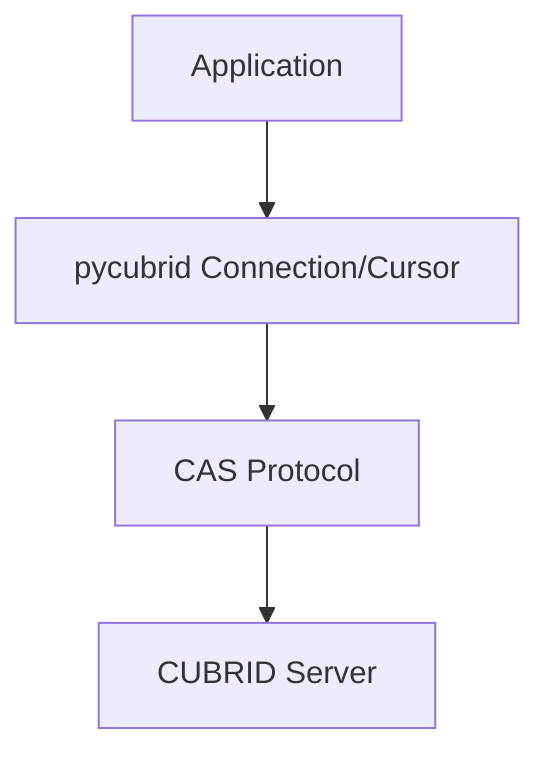

# pycubrid

**Pure Python DB-API 2.0 driver for the CUBRID database** — no C extensions, no compilation, implements the PEP 249 (DB-API 2.0) interface.

[🇰🇷 한국어](docs/README.ko.md) · [🇺🇸 English](README.md) · [🇨🇳 中文](docs/README.zh.md) · [🇮🇳 हिन्दी](docs/README.hi.md) · [🇩🇪 Deutsch](docs/README.de.md) · [🇷🇺 Русский](docs/README.ru.md)

<!-- BADGES:START -->
[](https://pypi.org/project/pycubrid)
[](https://www.python.org)
[](https://github.com/cubrid-lab/pycubrid/actions/workflows/ci.yml)
[](https://github.com/cubrid-lab/pycubrid/actions/workflows/integration-full.yml)
[](https://codecov.io/gh/cubrid-lab/pycubrid)
[](https://github.com/cubrid-lab/pycubrid/blob/main/LICENSE)
[](https://github.com/cubrid-lab/pycubrid)
[](https://cubrid-lab.github.io/pycubrid/)
<!-- BADGES:END -->

---

> **Status: Beta.** The core public API follows semantic versioning; minor releases may add features and bug fixes while the project remains under active development.

## Why pycubrid?

CUBRID is a high-performance open-source relational database, widely adopted in
Korean public-sector and enterprise applications. The existing C-extension driver
(`CUBRIDdb`) had build dependencies and platform compatibility issues.

**pycubrid** solves these problems:

- **Pure Python implementation** — no C build dependencies, install with `pip install` only
- **Implements PEP 249 (DB-API 2.0)** — standard exception hierarchy, type objects, cursor interface
- **800+ offline tests** with **97%+ code coverage** — most tests run without a database
- **TLS/SSL for sync connections** — opt-in `ssl=True` (verified context) or custom `ssl.SSLContext` on `connect()`
- **Native asyncio support** — async/await API via `pycubrid.aio` for high-concurrency applications
- **PEP 561 typed package** — `py.typed` marker for modern IDE and static analysis support
- **Direct CUBRID CAS protocol** implementation — no additional middleware required
- **LOB (CLOB/BLOB) support** — handle large text and binary data

## Requirements

- Python 3.10+
- CUBRID database server 10.2+ (CI validates 10.2, 11.0, 11.2, 11.4)

## Installation

```bash
pip install pycubrid
```

## Quick Start

### Basic Connection

```python
import pycubrid

conn = pycubrid.connect(
    host="localhost",
    port=33000,
    database="testdb",
    user="dba",
    password="",
)

cur = conn.cursor()
cur.execute("SELECT 1 + 1")
print(cur.fetchone())  # (2,)

cur.close()
conn.close()
```

### Context Manager

```python
import pycubrid

with pycubrid.connect(host="localhost", port=33000, database="testdb", user="dba") as conn:
    with conn.cursor() as cur:
        cur.execute("CREATE TABLE IF NOT EXISTS cookbook_users (id INT AUTO_INCREMENT PRIMARY KEY, name VARCHAR(100))")
        cur.execute("INSERT INTO cookbook_users (name) VALUES (?)", ("Alice",))
        conn.commit()

        cur.execute("SELECT * FROM cookbook_users")
        for row in cur:
            print(row)
```

### Async

```python
import asyncio
import pycubrid.aio

async def main():
    conn = await pycubrid.aio.connect(
        host="localhost", port=33000, database="testdb", user="dba"
    )
    cur = conn.cursor()
    await cur.execute("SELECT 1 + 1")
    print(await cur.fetchone())  # (2,)
    await cur.close()
    await conn.close()

asyncio.run(main())
```

### Parameter Binding

```python
# qmark style (question marks)
cur.execute("SELECT * FROM users WHERE name = ? AND age > ?", ("Alice", 25))

# Batch insert with executemany
data = [("Alice", 30), ("Bob", 25), ("Charlie", 35)]
cur.executemany("INSERT INTO users (name, age) VALUES (?, ?)", data)
conn.commit()
```

### Parameterized Queries

```python
sql = "SELECT * FROM users WHERE department = ?"

cur.execute(sql, ("Engineering",))
engineers = cur.fetchall()

cur.execute(sql, ("Marketing",))
marketers = cur.fetchall()
```

## PEP 249 Compliance

| Attribute | Value |
|---|---|
| `apilevel` | `"2.0"` |
| `threadsafety` | `1` (connections cannot be shared between threads) |
| `paramstyle` | `"qmark"` (positional parameters `?`) |

- Full standard exception hierarchy: `Warning`, `Error`, `InterfaceError`, `DatabaseError`, `OperationalError`, `IntegrityError`, `InternalError`, `ProgrammingError`, `NotSupportedError`
- Standard type objects: `STRING`, `BINARY`, `NUMBER`, `DATETIME`, `ROWID`
- Standard constructors: `Date()`, `Time()`, `Timestamp()`, `Binary()`, `DateFromTicks()`, `TimeFromTicks()`, `TimestampFromTicks()`
- `nextset()` raises `NotSupportedError` (CUBRID does not support multiple result sets)

## Features

- **Pure Python** — no C extensions, no compilation, works everywhere Python runs
- **Complete DB-API 2.0** — `connect()`, `Cursor`, `fetchone/many/all`, `executemany`, `callproc`
- **Parameterized queries** — `cursor.execute(sql, params)` with server-side `PREPARE_AND_EXECUTE`
- **Batch operations** — `executemany()` and `executemany_batch()` for bulk inserts
- **LOB support** — `create_lob()`, read/write CLOB and BLOB columns
- **Schema introspection** — `get_schema_info()` for tables, columns, indexes, constraints
- **Auto-commit control** — `connection.autocommit` property for transaction management
- **Server version detection** — `connection.get_server_version()` returns version string (e.g., `"11.2.0.0378"`)
- **Iterator protocol** — iterate over cursor results with `for row in cursor`
- **Context managers** — `with` statements for both connections and cursors
- **Async support** — `pycubrid.aio.connect()` with `AsyncConnection` and `AsyncCursor` for asyncio event loops
- **Per-cursor fetch size** — `cursor.fetch_size` property to tune server-side fetch batch size per cursor

## Supported CUBRID Versions

The project targets CUBRID 10.2+ (protocol-compatible). CI validates against:

- 10.2
- 11.0
- 11.2
- 11.4

## SQLAlchemy Integration

pycubrid works as a driver for [sqlalchemy-cubrid](https://github.com/cubrid-lab/sqlalchemy-cubrid) — the SQLAlchemy 2.0 dialect for CUBRID:

```bash
pip install "sqlalchemy-cubrid[pycubrid]"
```

```python
from sqlalchemy import create_engine, text

engine = create_engine("cubrid+pycubrid://dba@localhost:33000/testdb")

with engine.connect() as conn:
    result = conn.execute(text("SELECT 1"))
    print(result.scalar())
```

SQLAlchemy features (ORM, Core, Alembic migrations, schema reflection) are accessible through the pycubrid driver when used with sqlalchemy-cubrid.

## Documentation

| Guide | Description |
|---|---|
| [Connection](docs/CONNECTION.md) | Connection strings, URL format, configuration |
| [Type Mapping](docs/TYPES.md) | Full type mapping, CUBRID-specific types, collection types |
| [API Reference](docs/API_REFERENCE.md) | Complete API documentation — modules, classes, functions |
| [Protocol](docs/PROTOCOL.md) | CAS wire protocol reference |
| [Development](docs/DEVELOPMENT.md) | Dev setup, testing, Docker, coverage, CI/CD |
| [Examples](docs/EXAMPLES.md) | Practical usage examples with code |
| [Troubleshooting](docs/TROUBLESHOOTING.md) | Connection errors, query problems, LOB handling, debugging |

## Compatibility

| | Python 3.10 | Python 3.11 | Python 3.12 | Python 3.13 | Python 3.14 |
|---|:---:|:---:|:---:|:---:|:---:|
| **Offline Tests** | ✅ | ✅ | ✅ | ✅ | ✅ |
| **CUBRID 11.4** | ✅ | -- | -- | -- | ✅ |
| **CUBRID 11.2** | ✅ | -- | -- | -- | ✅ |
| **CUBRID 11.0** | ✅ | -- | -- | -- | ✅ |
| **CUBRID 10.2** | ✅ | -- | -- | -- | ✅ |

CI runs the matrix above on every PR/push (Python 3.10 + 3.14 anchors × all CUBRID versions).
The full **5 × 4** Python × CUBRID matrix runs nightly, on tagged releases, and on demand via `workflow_dispatch`.

## Architecture



```mermaid
graph TD
    root[pycubrid/]
    init[__init__.py - Public API connect(), types, exceptions, __version__]
    connection[connection.py - Connection class connect/commit/rollback/cursor/LOB]
    cursor[cursor.py - Cursor class execute/fetch/executemany/callproc/iterator]
    types[types.py - DB-API 2.0 type objects and constructors]
    exceptions[exceptions.py - PEP 249 exception hierarchy]
    constants[constants.py - CAS function codes, data types, protocol constants]
    protocol[protocol.py - CAS wire protocol packet classes (18 packet types)]
    packet[packet.py - Low-level packet reader/writer]
    lob[lob.py - LOB support]
    typed[py.typed - PEP 561 marker]

    root --> init
    root --> connection
    root --> cursor
    root --> types
    root --> exceptions
    root --> constants
    root --> protocol
    root --> packet
    root --> lob
    root --> typed
    root --> aio
    aio[aio/ - AsyncConnection, AsyncCursor, async connect()]
```

## FAQ

### How do I connect to CUBRID with Python?

```python
import pycubrid
conn = pycubrid.connect(host="localhost", port=33000, database="testdb", user="dba")
```

### How do I install pycubrid?

`pip install pycubrid` — no C extensions or build tools required.

### What parameter style does pycubrid use?

Question mark (`qmark`) style: `cursor.execute("SELECT * FROM users WHERE id = ?", (1,))`

### Does pycubrid work with SQLAlchemy?

Yes. Install `pip install "sqlalchemy-cubrid[pycubrid]"` and use the connection URL `cubrid+pycubrid://dba@localhost:33000/testdb`.

### What Python versions are supported?

Python 3.10, 3.11, 3.12, 3.13, and 3.14.

### Does pycubrid support LOBs (CLOB/BLOB)?

Yes. Insert strings/bytes directly into CLOB/BLOB columns. For reading, LOB columns return data that can be accessed through the cursor.

### Is pycubrid thread-safe?

pycubrid has `threadsafety = 1`, meaning connections cannot be shared between threads. Create a separate connection per thread.

### What CUBRID versions are supported?

CUBRID 10.2, 11.0, 11.2, and 11.4 are tested in CI.

### Does pycubrid support async/await?

Yes. Use `pycubrid.aio.connect()` for native asyncio support. The async surface is similar to the sync API: `await conn.ping(reconnect=...)` performs the same native `CHECK_CAS` health check as sync `Connection.ping()`, `create_lob()` remains sync-only, and auto-commit changes use `await conn.set_autocommit(...)` instead of a property setter.


## Related Projects

- [sqlalchemy-cubrid](https://github.com/cubrid-lab/sqlalchemy-cubrid) — SQLAlchemy 2.0 dialect for CUBRID
- [cubrid-python-cookbook](https://github.com/cubrid-lab/cubrid-python-cookbook) — Production-ready Python examples for CUBRID


## Roadmap

See [`ROADMAP.md`](ROADMAP.md) for this project's direction and next milestones.

For the ecosystem-wide view, see the [CUBRID Labs Ecosystem Roadmap](https://github.com/cubrid-lab/.github/blob/main/ROADMAP.md) and [Project Board](https://github.com/orgs/cubrid-lab/projects/2).

## Contributing

See [CONTRIBUTING.md](CONTRIBUTING.md) for guidelines and [docs/DEVELOPMENT.md](docs/DEVELOPMENT.md) for development setup.

## Security

Report vulnerabilities via email — see [SECURITY.md](SECURITY.md). Do not open public issues for security concerns.

## License

MIT — see [LICENSE](LICENSE).
