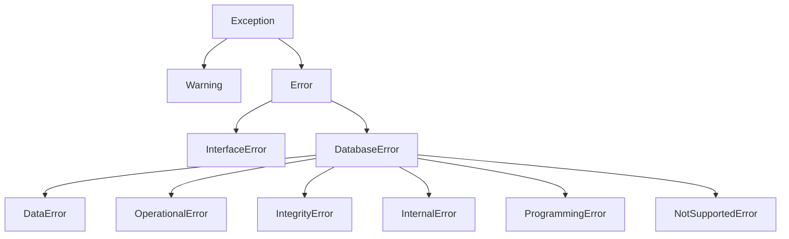

# API Reference

Complete API documentation for pycubrid — a pure Python DB-API 2.0 driver for CUBRID.

---

## Table of Contents

- [Module-Level Attributes](#module-level-attributes)
- [Module-Level Constructor](#module-level-constructor)
  - [`pycubrid.connect()`](#pycubridconnect)
  - [`decode_collections`](#decode_collections)
  - [`json_deserializer`](#json-columns)
- [Async Module Constructor](#async-module-constructor)
  - [`pycubrid.aio.connect()`](#pycubridaioconnect)
- [Connection Class](#connection-class)
  - [Constructor](#connection-constructor)
  - [Methods](#connection-methods)
    - [`ping()`](#pingreconnecttrue)
  - [Properties](#connection-properties)
  - [Context Manager](#connection-context-manager)
- [Cursor Class](#cursor-class)
  - [Constructor](#cursor-constructor)
  - [Methods](#cursor-methods)
    - [`nextset()`](#nextset)
  - [Properties](#cursor-properties)
  - [Iterator Protocol](#iterator-protocol)
  - [Context Manager](#cursor-context-manager)
- [AsyncConnection Class](#asyncconnection-class)
- [AsyncCursor Class](#asynccursor-class)
- [Lob Class](#lob-class)
  - [Factory Method](#lob-factory-method)
  - [Methods](#lob-methods)
  - [Properties](#lob-properties)
- [TimingStats Class](#timingstats-class)
- [Exception Hierarchy](#exception-hierarchy)
  - [Warning](#warning)
  - [Error](#error)
  - [InterfaceError](#interfaceerror)
  - [DatabaseError](#databaseerror)
  - [DataError](#dataerror)
  - [OperationalError](#operationalerror)
  - [IntegrityError](#integrityerror)
  - [InternalError](#internalerror)
  - [ProgrammingError](#programmingerror)
  - [NotSupportedError](#notsupportederror)
- [Type Objects](#type-objects)
- [Type Constructors](#type-constructors)

---

## Module-Level Attributes

These attributes are defined at the module level as required by PEP 249.

| Attribute      | Value     | Description |
|----------------|-----------|-------------|
| `apilevel`     | `"2.0"`   | DB-API specification version |
| `threadsafety` | `1`       | Threads may share the module but not connections |
| `paramstyle`   | `"qmark"` | Question mark parameter style: `WHERE name = ?` |
| `__version__`  | `"1.3.0"` | Package version string |

```python
import pycubrid

print(pycubrid.apilevel)      # "2.0"
print(pycubrid.threadsafety)  # 1
print(pycubrid.paramstyle)    # "qmark"
print(pycubrid.__version__)   # "1.3.0"
```

---

## Module-Level Constructor

### `pycubrid.connect()`

```python
def connect(
    host: str = "localhost",
    port: int = 33000,
    database: str = "",
    user: str = "dba",
    password: str = "",
    decode_collections: bool = False,
    json_deserializer: Any = None,
    ssl: bool | ssl_module.SSLContext | None = None,
    **kwargs: Any,
) -> Connection
```

Create a new database connection.

**Parameters:**

| Parameter | Type | Default | Description |
|---|---|---|---|
| `host` | `str` | `"localhost"` | CUBRID server hostname or IP address |
| `port` | `int` | `33000` | CUBRID broker port |
| `database` | `str` | `""` | Database name |
| `user` | `str` | `"dba"` | Database user |
| `password` | `str` | `""` | Database password |
| `decode_collections` | `bool` | `False` | Decode SET/MULTISET/SEQUENCE columns into Python collections |
| `json_deserializer` | `Any` | `None` | Callable used to decode JSON columns on fetch; when unset JSON is returned as `str` |
| `ssl` | `bool \| ssl_module.SSLContext \| None` | `None` | Opt-in TLS for sync broker connections |
| `**kwargs` | `Any` | — | Additional parameters such as `connect_timeout`, `read_timeout`, `fetch_size`, `enable_timing`, `no_backslash_escapes`, and `autocommit` |

#### `decode_collections`

When `False` (the default), collection columns are returned as raw CAS wire `bytes` for backward
compatibility. When `True`, pycubrid decodes supported `SET`, `MULTISET`, and `SEQUENCE` payloads
into Python containers.

#### JSON Columns

`json_deserializer` controls JSON column decoding on fetch:

| Setting | Result |
|---|---|
| `None` (default) | Return JSON columns as `str` |
| `callable` | Pass the raw JSON string to the callable and return its result |

**Returns:** A new `Connection` instance.

**Raises:** `OperationalError` if the connection cannot be established.

```python
import pycubrid

# Minimal connection
conn = pycubrid.connect(database="testdb")

# Full connection with timeout
conn = pycubrid.connect(
    host="192.168.1.100",
    port=33000,
    database="production",
    user="app_user",
    password="secret",
    connect_timeout=5.0,
)
```

---

## Async Module Constructor

### `pycubrid.aio.connect()`

```python
async def connect(
    host: str = "localhost",
    port: int = 33000,
    database: str = "",
    user: str = "dba",
    password: str = "",
    decode_collections: bool = False,
    json_deserializer: Any = None,
    ssl: bool | ssl_module.SSLContext | None = None,
    **kwargs: Any,
) -> AsyncConnection
```

Create and open an async connection.

- Returns a connected `AsyncConnection`.
- Accepts the same collection / JSON decoding kwargs as `pycubrid.connect()`.
- Supports `autocommit=True` via `await conn.set_autocommit(True)` during construction.
- Provides a similar async surface to the sync API, including `await conn.ping(reconnect=...)`; `create_lob()` remains sync-only, and auto-commit changes go through `await conn.set_autocommit(...)` instead of a property setter.
- Async TLS is not yet supported; passing `ssl=True` or an `SSLContext` raises `NotSupportedError`.

```python
import asyncio
import pycubrid.aio

async def main() -> None:
    conn = await pycubrid.aio.connect(database="testdb")
    cur = conn.cursor()
    await cur.execute("SELECT 1")
    print(await cur.fetchone())
    await cur.close()
    await conn.close()

asyncio.run(main())
```

---

## Connection Class

`pycubrid.connection.Connection`

Represents a single connection to a CUBRID database via the CAS broker protocol.

### Connection Constructor

```python
class Connection:
    def __init__(
        self,
        host: str,
        port: int,
        database: str,
        user: str,
        password: str,
        autocommit: bool = False,
        **kwargs: Any,
    ) -> None
```

> **Note:** Do not instantiate `Connection` directly. Use `pycubrid.connect()` instead.

**Selected `**kwargs`:**

| Name | Type | Default | Description |
|---|---|---|---|
| `enable_timing` | `bool \| None` | `None` | Enable optional driver-level timing instrumentation for `connect`, `execute`, `fetch`, and `close` operations. When `None`, falls back to the `PYCUBRID_ENABLE_TIMING` environment variable (truthy values: `1`, `true`, `yes`, case-insensitive). When disabled, the timing module is not imported and `connection.timing_stats` is `None` (zero overhead). See [Timing & Profiling Hooks](PERFORMANCE.md#timing--profiling-hooks). |
| `ssl` | `bool \| ssl.SSLContext \| None` | `None` | TLS configuration for sync connections. See [Connection guide](CONNECTION.md). |
| `read_timeout` | `float \| None` | `None` | Socket read timeout in seconds. |
| `fetch_size` | `int` | `100` | Server-side fetch batch size. |
| `json_deserializer` | `Callable[[str], Any] \| None` | `None` | Opt-in JSON column decoder. |
| `decode_collections` | `bool` | `False` | Decode SET/MULTISET/SEQUENCE columns into Python collections. |

### Connection Methods

#### `connect()`

```python
def connect(self) -> None
```

Establish a TCP CAS session with broker handshake and open the database.
Called automatically by the constructor. Calling on an already-connected instance is a no-op.

**Raises:** `OperationalError` on network failure.

---

#### `close()`

```python
def close(self) -> None
```

Close the connection and all tracked cursors. Sends a `CloseDatabasePacket` to the server. Calling on an already-closed connection is a no-op. After `close()`, any further method calls will raise `InterfaceError`.

```python
conn = pycubrid.connect(database="testdb")
# ... work ...
conn.close()  # Connection and all cursors are closed
```

---

#### `commit()`

```python
def commit(self) -> None
```

Commit the current transaction. Sends a `CommitPacket` to the server.

**Raises:** `InterfaceError` if the connection is closed.

---

#### `rollback()`

```python
def rollback(self) -> None
```

Roll back the current transaction. Sends a `RollbackPacket` to the server.

**Raises:** `InterfaceError` if the connection is closed.

---

#### `cursor()`

```python
def cursor(self) -> Cursor
```

Create and return a new `Cursor` bound to this connection. The cursor is tracked by the connection and will be closed when the connection closes.

**Returns:** A new `Cursor` instance.

**Raises:** `InterfaceError` if the connection is closed.

```python
conn = pycubrid.connect(database="testdb")
cur = conn.cursor()
cur.execute("SELECT 1 + 1")
print(cur.fetchone())  # (2,)
cur.close()
```

---

#### `get_server_version()`

```python
def get_server_version(self) -> str
```

Return the server engine version string (e.g., `"11.2.0.0378"`).

```python
conn = pycubrid.connect(database="testdb")
print(conn.get_server_version())  # "11.2.0.0378"
```

---

#### `get_last_insert_id()`

```python
def get_last_insert_id(self) -> str
```

Return the last auto-increment value generated by an INSERT statement, as a string.

```python
cur.execute("INSERT INTO users (name) VALUES ('alice')")
conn.commit()
print(conn.get_last_insert_id())  # "1"
```

---

#### `ping(reconnect=True)`

```python
def ping(self, reconnect: bool = True) -> bool
```

Perform a lightweight `CHECK_CAS` health check without executing SQL.

- Returns `True` when the CAS connection is alive.
- When `reconnect=True`, attempts reconnection before returning `False`.

```python
if not conn.ping():
    raise RuntimeError("database connection is unavailable")
```

---

#### `create_lob(lob_type)`

```python
def create_lob(self, lob_type: int) -> Lob
```

Create a new LOB (Large Object) on the server.

**Parameters:**

| Parameter  | Type  | Description |
|------------|-------|-------------|
| `lob_type` | `int` | LOB type code: `23` for BLOB, `24` for CLOB |

**Returns:** A new `Lob` instance.

```python
from pycubrid.constants import CUBRIDDataType

lob = conn.create_lob(CUBRIDDataType.CLOB)  # 24
lob.write(b"Hello, CUBRID!")
```

> **Important:** `Lob` objects cannot be passed as query parameters. Insert strings/bytes directly into CLOB/BLOB columns instead. See [TYPES.md](TYPES.md) for details.

---

#### `get_schema_info(schema_type, table_name, pattern_match_flag)`

```python
def get_schema_info(
    self,
    schema_type: int,
    table_name: str = "",
    pattern_match_flag: int = 1,
) -> GetSchemaPacket
```

Query schema information from the server.

**Parameters:**

| Parameter            | Type  | Default | Description |
|----------------------|-------|---------|-------------|
| `schema_type`        | `int` | —       | Schema type code (see `CCISchemaType`) |
| `table_name`         | `str` | `""`    | Table name filter |
| `pattern_match_flag` | `int` | `1`     | Pattern match flag |

**Returns:** A `GetSchemaPacket` with `query_handle` and `tuple_count` attributes.

```python
from pycubrid.constants import CCISchemaType

packet = conn.get_schema_info(CCISchemaType.CLASS)
print(f"Found {packet.tuple_count} tables")
```

**Available `CCISchemaType` values:**

| Code | Name              | Description |
|------|-------------------|-------------|
| 1    | `CLASS`           | Tables |
| 2    | `VCLASS`          | Views |
| 4    | `ATTRIBUTE`       | Columns |
| 11   | `CONSTRAINT`      | Constraints |
| 16   | `PRIMARY_KEY`     | Primary keys |
| 17   | `IMPORTED_KEYS`   | Foreign keys (imported) |
| 18   | `EXPORTED_KEYS`   | Foreign keys (exported) |

---

### Connection Properties

#### `autocommit`

```python
@property
def autocommit(self) -> bool

@autocommit.setter
def autocommit(self, value: bool) -> None
```

Get or set the auto-commit mode. When enabled, each statement is committed immediately. Setting this property sends a `SetDbParameterPacket` and `CommitPacket` to flush the transaction state on the server.

```python
conn = pycubrid.connect(database="testdb")
print(conn.autocommit)  # False

conn.autocommit = True
# Statements now auto-commit
```

---

#### `timing_stats`

```python
@property
def timing_stats(self) -> TimingStats | None
```

Return the per-connection [`TimingStats`](#timingstats-class) accumulator when the connection
was opened with `enable_timing=True` (or with `PYCUBRID_ENABLE_TIMING` set). Returns `None`
when timing is disabled — in which case the timing module is never imported and the hot
path incurs no overhead.

```python
import pycubrid

conn = pycubrid.connect(database="testdb", enable_timing=True)
cur = conn.cursor()
cur.execute("SELECT 1")
cur.fetchall()

stats = conn.timing_stats
assert stats is not None
print(stats)
# TimingStats(connect=1 calls, 12.345ms total, 12.345ms avg,
#             execute=1 calls, 0.987ms total, 0.987ms avg,
#             fetch=1 calls, 0.123ms total, 0.123ms avg,
#             close=0 calls)

print(stats.execute_count, stats.execute_total_ns)  # 1 987000

stats.reset()  # clear all counters
```

See [Timing & Profiling Hooks](PERFORMANCE.md#timing--profiling-hooks) for the full guide.

---

### Connection Context Manager

`Connection` implements the context manager protocol (`__enter__` / `__exit__`).

- On successful exit: calls `commit()` then `close()`.
- On exception: calls `rollback()` then `close()`.

```python
with pycubrid.connect(database="testdb") as conn:
    cur = conn.cursor()
    cur.execute("INSERT INTO users (name) VALUES ('bob')")
    # Auto-commits on exit

# conn is closed here
```

---

## Cursor Class

`pycubrid.cursor.Cursor`

Represents a database cursor for executing SQL statements and fetching results.

### Cursor Constructor

```python
class Cursor:
    def __init__(self, connection: Connection) -> None
```

> **Note:** Do not instantiate `Cursor` directly. Use `connection.cursor()` instead.

### Cursor Methods

#### `execute(operation, parameters)`

```python
def execute(
    self,
    operation: str,
    parameters: Sequence[Any] | None = None,
) -> Cursor
```

Prepare and execute a SQL statement.

**Parameters:**

| Parameter    | Type | Description |
|--------------|------|-------------|
| `operation`  | `str` | SQL statement with optional `?` placeholders |
| `parameters` | `Sequence` or `None` | Non-string positional parameter values to bind |

**Returns:** The cursor itself (for chaining).

**Raises:**
- `InterfaceError` if the cursor is closed
- `ProgrammingError` on SQL errors or parameter mismatch

```python
# Simple query
cur.execute("SELECT * FROM users")

# Parameterized query (qmark style)
cur.execute("SELECT * FROM users WHERE age > ?", [21])

# INSERT with parameters
cur.execute("INSERT INTO users (name, age) VALUES (?, ?)", ["alice", 30])
```

> **Important:** mappings such as `dict` are not supported for parameter binding. Passing a
> mapping raises `ProgrammingError("parameters must be a sequence")`.

**Supported parameter types:**

| Python Type          | SQL Literal |
|----------------------|-------------|
| `None`               | `NULL` |
| `bool`               | `1` / `0` |
| `str`                | `'escaped'` |
| `bytes`              | `X'hex'` |
| `int`, `float`       | Numeric literal |
| `Decimal`            | Numeric literal |
| `datetime.date`      | `DATE'YYYY-MM-DD'` |
| `datetime.time`      | `TIME'HH:MM:SS'` |
| `datetime.datetime`  | `DATETIME'YYYY-MM-DD HH:MM:SS.mmm'` |

---

#### `executemany(operation, seq_of_parameters)`

```python
def executemany(
    self,
    operation: str,
    seq_of_parameters: Sequence[Sequence[Any]],
) -> Cursor
```

Execute the same SQL statement repeatedly with different parameter sets. Each element must be a
non-string sequence. For non-SELECT statements, `rowcount` is set to the cumulative total of
affected rows.

```python
data = [("alice", 30), ("bob", 25), ("carol", 28)]
cur.executemany("INSERT INTO users (name, age) VALUES (?, ?)", data)
print(cur.rowcount)  # 3
```

---

#### `nextset()`

```python
def nextset(self) -> None
```

DB-API compatibility method. pycubrid does not expose multiple server result sets through this
interface, so `nextset()` always returns `None` after checking that the cursor is still open.

```python
assert cur.nextset() is None
```

---

#### `executemany_batch(sql_list, auto_commit)`

```python
def executemany_batch(
    self,
    sql_list: list[str],
    auto_commit: bool | None = None,
) -> list[tuple[int, int]]
```

Execute multiple **distinct** SQL statements in a single batch request to the server. This is more efficient than calling `execute()` in a loop when the SQL statements differ.

**Parameters:**

| Parameter     | Type | Description |
|---------------|------|-------------|
| `sql_list`    | `list[str]` | List of complete SQL statements |
| `auto_commit` | `bool` or `None` | Override auto-commit for this batch (default: connection setting) |

**Returns:** List of `(statement_type, result_count)` tuples.

```python
results = cur.executemany_batch([
    "CREATE TABLE t1 (id INT AUTO_INCREMENT PRIMARY KEY, val VARCHAR(50))",
    "INSERT INTO t1 (val) VALUES ('hello')",
    "INSERT INTO t1 (val) VALUES ('world')",
])
# results: [(4, 0), (20, 1), (20, 1)]
# statement_type 4 = CREATE_CLASS, 20 = INSERT
```

> **Note:** `executemany_batch` is a pycubrid extension, not part of PEP 249.

---

#### `fetchone()`

```python
def fetchone(self) -> tuple[Any, ...] | None
```

Fetch the next row of a query result set. Returns `None` when no more rows are available. Automatically fetches more rows from the server when the local buffer is exhausted (100 rows per fetch).

```python
cur.execute("SELECT name, age FROM users")
row = cur.fetchone()
if row:
    name, age = row
```

---

#### `fetchmany(size)`

```python
def fetchmany(self, size: int | None = None) -> list[tuple[Any, ...]]
```

Fetch the next `size` rows. Defaults to `cursor.arraysize` if `size` is not specified.

```python
cur.execute("SELECT * FROM users")
batch = cur.fetchmany(10)  # Up to 10 rows
```

---

#### `fetchall()`

```python
def fetchall(self) -> list[tuple[Any, ...]]
```

Fetch all remaining rows of a query result. Returns an empty list if no rows remain.

```python
cur.execute("SELECT * FROM users")
all_rows = cur.fetchall()
for row in all_rows:
    print(row)
```

---

#### `callproc(procname, parameters)`

```python
def callproc(
    self,
    procname: str,
    parameters: Sequence[Any] = (),
) -> Sequence[Any]
```

Call a stored procedure. Constructs and executes a `CALL procname(?, ?, ...)` statement.

**Returns:** The original `parameters` sequence (as per PEP 249).

```python
cur.callproc("my_procedure", [1, "hello"])
```

---

#### `setinputsizes(sizes)`

```python
def setinputsizes(self, sizes: Any) -> None
```

DB-API no-op. Accepted for compatibility.

---

#### `setoutputsize(size, column)`

```python
def setoutputsize(self, size: int, column: int | None = None) -> None
```

DB-API no-op. Accepted for compatibility.

---

#### `close()`

```python
def close(self) -> None
```

Close the cursor and release the active query handle. Calling on an already-closed cursor is a no-op.

---

### Cursor Properties

#### `description`

```python
@property
def description(self) -> tuple[DescriptionItem, ...] | None
```

Return result-set metadata for the last executed statement, or `None` if no query has been executed or the last statement did not return rows.

Each item is a 7-tuple:

```python
(name, type_code, display_size, internal_size, precision, scale, null_ok)
#  str    int        None           None          int       int    bool
```

| Index | Field          | Type   | Description |
|-------|----------------|--------|-------------|
| 0     | `name`         | `str`  | Column name |
| 1     | `type_code`    | `int`  | CUBRID data type code (see `CUBRIDDataType`) |
| 2     | `display_size` | `None` | Not used |
| 3     | `internal_size`| `None` | Not used |
| 4     | `precision`    | `int`  | Column precision |
| 5     | `scale`        | `int`  | Column scale |
| 6     | `null_ok`      | `bool` | Whether the column is nullable |

```python
cur.execute("SELECT name, age FROM users")
for col in cur.description:
    print(f"{col[0]}: type={col[1]}, precision={col[4]}, nullable={col[6]}")
```

---

#### `rowcount`

```python
@property
def rowcount(self) -> int
```

Number of rows affected by the last `execute()` call. Returns `-1` for SELECT statements or if no statement has been executed.

---

#### `lastrowid`

```python
@property
def lastrowid(self) -> int | None
```

Last generated auto-increment identifier for an INSERT statement. `None` if no INSERT has been executed or the table has no auto-increment column.

```python
cur.execute("INSERT INTO users (name) VALUES ('alice')")
print(cur.lastrowid)  # e.g., 1
```

---

#### `arraysize`

```python
@property
def arraysize(self) -> int

@arraysize.setter
def arraysize(self, value: int) -> None
```

Default number of rows for `fetchmany()`. Defaults to `1`.

**Raises:** `ProgrammingError` if set to a value less than 1.

---

### Iterator Protocol

`Cursor` implements the iterator protocol, allowing you to iterate directly over result rows:

```python
cur.execute("SELECT name, age FROM users")
for name, age in cur:
    print(f"{name} is {age} years old")
```

Calls `fetchone()` internally. Raises `StopIteration` when no more rows.

---

### Cursor Context Manager

```python
with conn.cursor() as cur:
    cur.execute("SELECT 1")
    print(cur.fetchone())
# cur is automatically closed
```

---

## AsyncConnection Class

`pycubrid.aio.connection.AsyncConnection`

Async counterpart to `Connection` for use with `asyncio`, with a similar surface rather than full method-for-method parity.

### Selected Methods

| Method | Signature | Notes |
|---|---|---|
| `cursor()` | `def cursor(self) -> AsyncCursor` | Returns an async cursor immediately; do **not** await it |
| `commit()` | `async def commit(self) -> None` | Commit current transaction |
| `rollback()` | `async def rollback(self) -> None` | Roll back current transaction |
| `close()` | `async def close(self) -> None` | Close connection and tracked cursors |
| `ping()` | `async def ping(self, reconnect: bool = True) -> bool` | Native `CHECK_CAS` health check with optional reconnect |
| `get_server_version()` | `async def get_server_version(self) -> str` | Fetch engine version |
| `get_last_insert_id()` | `async def get_last_insert_id(self) -> str` | Fetch last AUTO_INCREMENT value |
| `get_schema_info()` | `async def get_schema_info(...) -> GetSchemaPacket` | Returns the parsed packet object |
| `set_autocommit()` | `async def set_autocommit(self, value: bool) -> None` | Sends `SetDbParameterPacket` and `CommitPacket` |

`AsyncConnection` exposes async `ping()` parity with sync `Connection.ping()`. `create_lob()` remains sync-only.
Concurrent awaiters on the same `AsyncConnection` are serialized with a per-connection
`asyncio.Lock`, so shared use is safe but requests still execute one at a time.

```python
async with await pycubrid.aio.connect(database="testdb") as conn:
    cur = conn.cursor()
    await cur.execute("INSERT INTO logs (msg) VALUES (?)", ["ok"])
    await conn.set_autocommit(True)
    await cur.close()
```

### `set_autocommit(value)`

`AsyncConnection.autocommit` is read-only; use `await conn.set_autocommit(True)` to change it.
Like the sync setter, this sends both `SetDbParameterPacket` and `CommitPacket`.

### `ping(reconnect=True)`

```python
async def ping(self, reconnect: bool = True) -> bool
```

Perform a lightweight native `CHECK_CAS` health check without executing SQL.

- Returns `True` when the CAS connection is alive.
- Always issues the native `CHECK_CAS` round-trip when the socket is open, regardless of the broker's transaction status (`CAS_INFO`).
- When `reconnect=False`, suppresses the implicit broker-handoff reconnect that normally fires on `CAS_INFO=INACTIVE`; returns `False` only if the socket is closed or `CHECK_CAS` itself fails.
- When `reconnect=True`, attempts close + reconnect on socket/protocol failure before returning `False`.

```python
if not await conn.ping(reconnect=False):
    await conn.ping(reconnect=True)
```

---

## AsyncCursor Class

`pycubrid.aio.cursor.AsyncCursor`

Async counterpart to `Cursor`.

### Selected Methods

| Method | Signature | Notes |
|---|---|---|
| `execute()` | `async def execute(self, operation: str, parameters: Sequence[Any] \| None = None) -> AsyncCursor` | Sequence-only parameter binding, same rules as sync cursor |
| `executemany()` | `async def executemany(self, operation: str, seq_of_parameters: Sequence[Sequence[Any]]) -> AsyncCursor` | Batch path for non-SELECT statements |
| `fetchone()` | `async def fetchone(self) -> tuple[Any, ...] \| None` | Returns one row or `None` |
| `fetchmany()` | `async def fetchmany(self, size: int \| None = None) -> list[tuple[Any, ...]]` | Uses `arraysize` by default |
| `fetchall()` | `async def fetchall(self) -> list[tuple[Any, ...]]` | Returns remaining rows |
| `nextset()` | `async def nextset(self) -> None` | DB-API compatibility method; always returns `None` |
| `close()` | `async def close(self) -> None` | Releases active query handle |

```python
cur = conn.cursor()          # not awaitable
await cur.execute("SELECT * FROM users WHERE age > ?", [21])
rows = await cur.fetchall()
assert await cur.nextset() is None
```

---

## Lob Class

`pycubrid.lob.Lob`

Represents a CUBRID Large Object (BLOB or CLOB).

### Lob Factory Method

#### `Lob.create(connection, lob_type)`

```python
@classmethod
def create(cls, connection: Connection, lob_type: int) -> Lob
```

Create a new LOB object on the server. Prefer using `connection.create_lob()` instead.

**Parameters:**

| Parameter    | Type         | Description |
|--------------|--------------|-------------|
| `connection` | `Connection` | Active database connection |
| `lob_type`   | `int`        | `CUBRIDDataType.BLOB` (23) or `CUBRIDDataType.CLOB` (24) |

**Raises:** `ValueError` if `lob_type` is not BLOB or CLOB.

---

### Lob Methods

#### `write(data, offset)`

```python
def write(self, data: bytes, offset: int = 0) -> int
```

Write bytes to the LOB starting from `offset`.

**Returns:** Number of bytes written.

---

#### `read(length, offset)`

```python
def read(self, length: int, offset: int = 0) -> bytes
```

Read up to `length` bytes from the LOB starting from `offset`.

**Returns:** The read bytes.

---

### Lob Properties

#### `lob_handle`

```python
@property
def lob_handle(self) -> bytes
```

The raw LOB handle bytes used for server communication.

---

#### `lob_type`

```python
@property
def lob_type(self) -> int
```

The LOB type code (`23` = BLOB, `24` = CLOB).

---

### LOB Usage Notes

**LOB columns return a dict on fetch**, not a `Lob` object:

```python
cur.execute("SELECT clob_col FROM my_table")
row = cur.fetchone()
lob_info = row[0]
# {'lob_type': 24, 'lob_length': 1234, 'file_locator': '...', 'packed_lob_handle': b'...'}
```

**To insert LOB data**, pass strings/bytes directly:

```python
cur.execute("INSERT INTO my_table (clob_col) VALUES (?)", ["large text content"])
```

---

## TimingStats Class

`pycubrid.timing.TimingStats` — also re-exported as `pycubrid.TimingStats`.

Per-connection accumulator for optional driver-level timing instrumentation. Instances are
created automatically when a connection is opened with `enable_timing=True` (or with
`PYCUBRID_ENABLE_TIMING` set) and are exposed via [`Connection.timing_stats`](#timing_stats).

> **When to use:** quick in-process diagnosis of where wall-clock time is going (connect vs
> execute vs fetch vs close) without reaching for cProfile or external profilers. For deep
> hot-path analysis, prefer the standalone profiling scripts in
> [Performance Investigation](PERFORMANCE.md#performance-investigation).

### Counters

All counters are plain `int` attributes. Durations are nanoseconds captured via
`time.perf_counter_ns()`. Updates are serialised by an internal `threading.Lock` so the
object is safe to read from a thread other than the one driving the connection.

| Attribute | Type | Description |
|---|---|---|
| `connect_count` / `connect_total_ns` | `int` | Total number of `Connection.connect()` calls and cumulative elapsed time. Recorded even on failure. |
| `execute_count` / `execute_total_ns` | `int` | `Cursor.execute()` and `executemany()` calls and cumulative elapsed time. |
| `fetch_count`   / `fetch_total_ns`   | `int` | `fetchone()` / `fetchmany()` / `fetchall()` calls combined and cumulative elapsed time. |
| `close_count`   / `close_total_ns`   | `int` | `Connection.close()` calls and cumulative elapsed time. |

### Methods

#### `reset()`

```python
def reset(self) -> None
```

Reset every counter to zero atomically. Useful for measuring a specific code section after
a warm-up phase.

#### `__repr__()`

Returns a human-readable summary, e.g.:

```
TimingStats(connect=1 calls, 12.345ms total, 12.345ms avg,
            execute=10 calls, 4.200ms total, 0.420ms avg,
            fetch=10 calls, 1.500ms total, 0.150ms avg,
            close=0 calls)
```

### Async parity

`pycubrid.aio.AsyncConnection` accepts the same `enable_timing` keyword and exposes the
same `timing_stats` property with identical semantics. Async durations include event-loop
scheduling latency — treat them as end-to-end client-side latency, not pure server time.

---

## Exception Hierarchy

pycubrid implements the full PEP 249 exception hierarchy:



All exceptions have `msg` (str) and `code` (int) attributes. `DatabaseError` and its subclasses additionally have `errno` (int | None) and `sqlstate` (str | None).

---

### Warning

```python
class Warning(Exception):
    def __init__(self, msg: str = "", code: int = 0) -> None
```

Raised for important warnings (e.g., data truncation during insertion).

---

### Error

```python
class Error(Exception):
    def __init__(self, msg: str = "", code: int = 0) -> None
```

Base class for all pycubrid errors.

---

### InterfaceError

```python
class InterfaceError(Error)
```

Raised for errors related to the database interface — calling methods on closed connections/cursors, invalid arguments, etc.

---

### DatabaseError

```python
class DatabaseError(Error):
    def __init__(
        self,
        msg: str = "",
        code: int = 0,
        errno: int | None = None,
        sqlstate: str | None = None,
    ) -> None
```

Base class for database-side errors. Includes `errno` and `sqlstate` for server-reported error details.

---

### DataError

```python
class DataError(DatabaseError)
```

Raised for data processing problems (division by zero, numeric overflow, etc.).

---

### OperationalError

```python
class OperationalError(DatabaseError)
```

Raised for database operation errors (unexpected disconnect, memory errors, transaction failures, connection lost).

---

### IntegrityError

```python
class IntegrityError(DatabaseError)
```

Raised when relational integrity is affected (foreign key violation, duplicate key, constraint violation).

---

### InternalError

```python
class InternalError(DatabaseError)
```

Raised for internal database errors (invalid cursor state, out-of-sync transactions).

---

### ProgrammingError

```python
class ProgrammingError(DatabaseError)
```

Raised for programming errors (SQL syntax errors, table not found, wrong number of parameters, unsupported parameter types).

---

### NotSupportedError

```python
class NotSupportedError(DatabaseError)
```

Raised when an unsupported method or API is called.

---

### Error Classification

pycubrid automatically classifies server errors based on the error message:

| Keywords in error message | Exception raised |
|---------------------------|-----------------|
| `unique`, `duplicate`, `foreign key`, `constraint violation` | `IntegrityError` |
| `syntax`, `unknown class`, `does not exist`, `not found` | `ProgrammingError` |
| All others | `DatabaseError` |

---

## Type Objects

PEP 249 type objects for comparing `cursor.description` type codes:

| Type Object | Description | Matching CUBRID types |
|-------------|-------------|----------------------|
| `STRING`    | String types | `CHAR`, `STRING`, `NCHAR`, `VARNCHAR`, `ENUM`, `CLOB`, `JSON` |
| `BINARY`    | Binary types | `BIT`, `VARBIT`, `BLOB` |
| `NUMBER`    | Numeric types | `SHORT`, `INT`, `BIGINT`, `FLOAT`, `DOUBLE`, `NUMERIC`, `MONETARY` |
| `DATETIME`  | Date/time types | `DATE`, `TIME`, `DATETIME`, `TIMESTAMP` |
| `ROWID`     | Row ID types | `OBJECT` |

```python
import pycubrid

cur.execute("SELECT name FROM users")
type_code = cur.description[0][1]

if type_code == pycubrid.STRING:
    print("It's a string column")
```

---

## Type Constructors

PEP 249 constructor functions:

| Constructor         | Return Type          | Description |
|---------------------|----------------------|-------------|
| `Date(y, m, d)`     | `datetime.date`      | Construct a date |
| `Time(h, m, s)`     | `datetime.time`      | Construct a time |
| `Timestamp(y,m,d,h,m,s)` | `datetime.datetime` | Construct a timestamp |
| `DateFromTicks(t)`  | `datetime.date`      | Date from Unix ticks |
| `TimeFromTicks(t)`  | `datetime.time`      | Time from Unix ticks |
| `TimestampFromTicks(t)` | `datetime.datetime` | Timestamp from Unix ticks |
| `Binary(s)`         | `bytes`              | Binary string from bytes |

```python
import pycubrid

d = pycubrid.Date(2025, 1, 15)
t = pycubrid.Time(14, 30, 0)
ts = pycubrid.Timestamp(2025, 1, 15, 14, 30, 0)
b = pycubrid.Binary(b"\x00\x01\x02")
```
