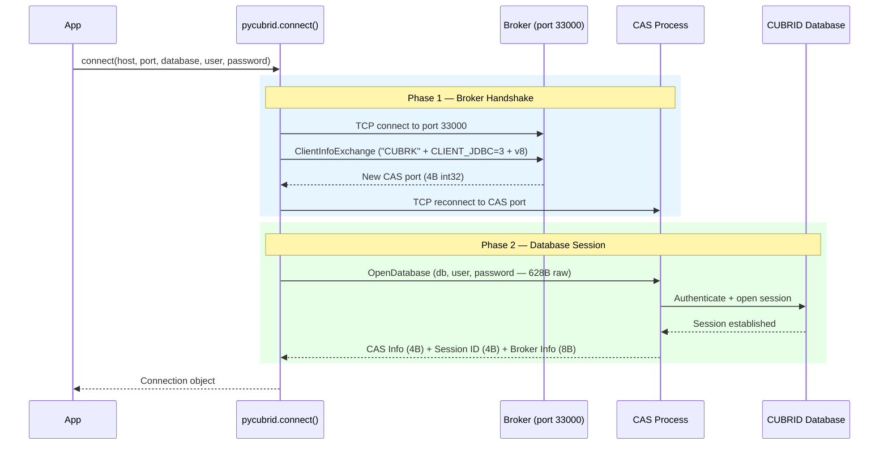
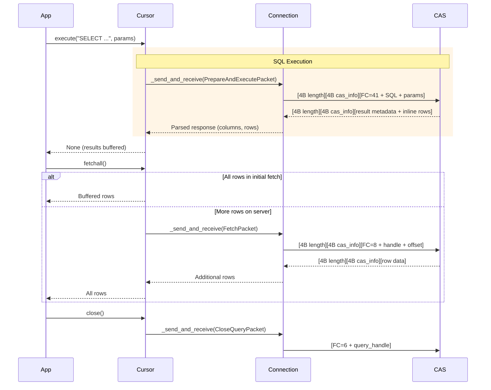
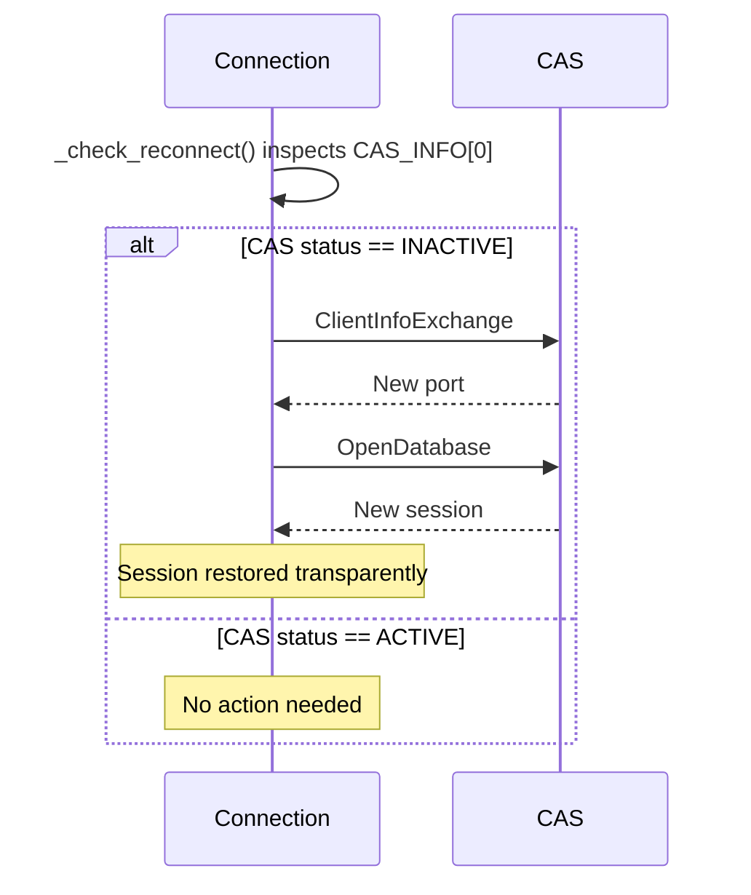
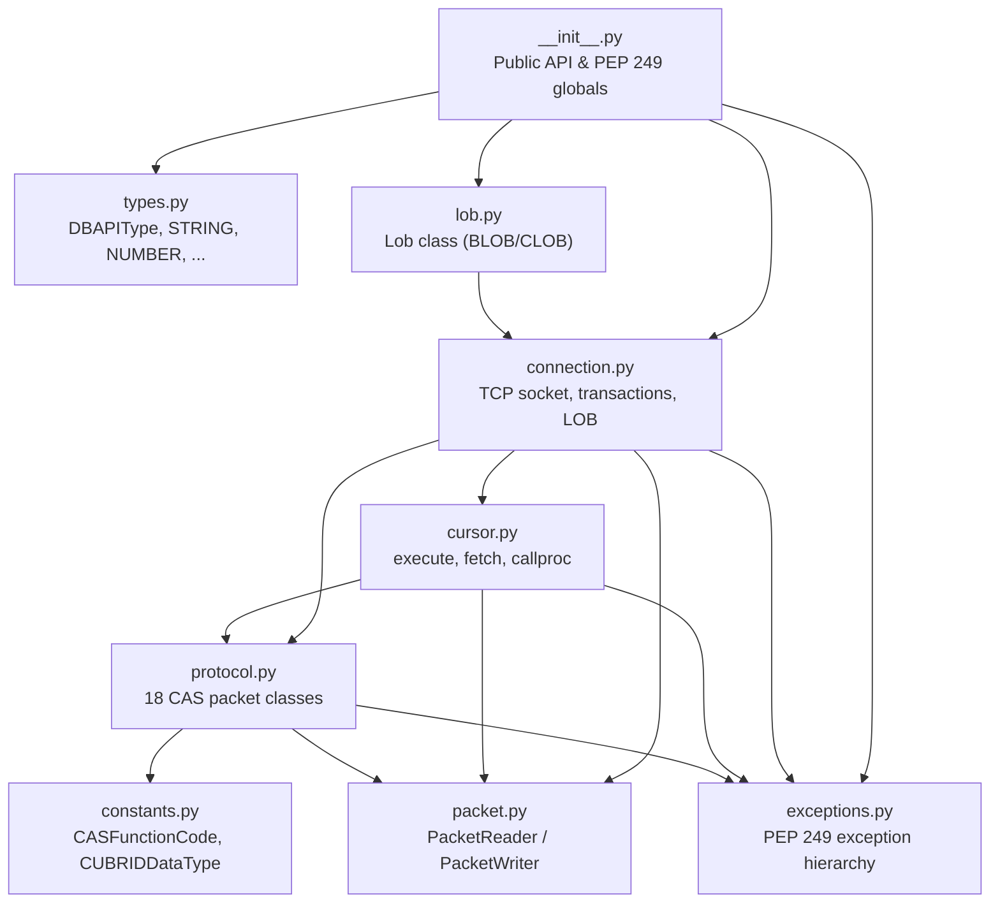
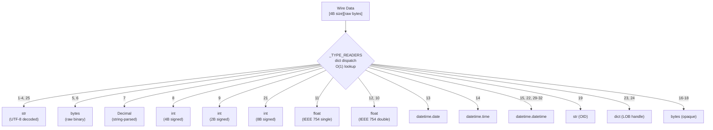

# Architecture

## Design Objectives

- **Pure Python**: Zero system dependencies, no C extensions or CCI library required, runs anywhere Python runs.
- **Full PEP 249 Compliance**: Implements the Python Database API Specification v2.0 for maximum compatibility.
- **CAS Binary Protocol v8**: Targets the current CUBRID CAS protocol version used by pycubrid.
- **Single-connection Synchronous Model**: Reliable, blocking I/O model suitable for standard application integration.
- **PEP 561 Typed**: Fully type-hinted for modern IDE support and static analysis.

## High-Level Flow

### Phase 1: Connection Handshake



### Phase 2: Query Lifecycle



## CAS Reconnection



## Module Boundaries



- **`__init__.py` — Public API & PEP 249 Globals**: The entry point of the package. It exposes the `connect` function, exception hierarchy, and DB-API type objects.
- **`connection.py` — TCP Socket & Transaction Management**: Manages the physical TCP connection to the CAS, handles transactions (commit/rollback), and acts as the owner for LOB operations.
- **`cursor.py` — SQL Execution & Result Fetching**: Implements the `Cursor` object, handling SQL preparation, execution, and the various fetch operations while maintaining state of results.
- **`protocol.py` — CAS Packet Classes**: Defines 18 specialized packet classes that map to CUBRID CAS function codes, handling the serialization and deserialization of specific requests and responses.
- **`packet.py` — PacketReader / PacketWriter**: Provides low-level utilities for reading from and writing to the wire format, handling byte order and primitive type serialization.
- **`constants.py` — CAS Constants**: Contains enumeration for CAS function codes, CUBRID data types, and other protocol-level constants.
- **`types.py` — DB-API Types**: Defines the type objects required by PEP 249 and manages the mapping between CUBRID types and Python types.
- **`exceptions.py` — PEP 249 Exceptions**: Implements the standard hierarchy of exceptions required by the DB-API 2.0 specification.
- **`lob.py` — LOB Management**: Implements the `Lob` class for handling Large Object data (BLOB/CLOB), providing an interface for reading and writing data in chunks.

## Packet Format

```text
┌─────────────────┬──────────────┬─────────────────────────┐
│  Data Length     │  CAS Info    │  Payload                │
│  (4 bytes)       │  (4 bytes)   │  (variable length)      │
│  big-endian int  │  session     │  [FC byte][arguments…]  │
└─────────────────┴──────────────┴─────────────────────────┘
```

The handshake packet (`ClientInfoExchange`) does NOT use this framing; it uses a specialized 10-byte fixed header for the initial broker negotiation.

## Type Dispatch



## Key Design Decisions

- **Pure Python over C extension**: Zero system dependencies ensure the driver runs anywhere Python is available, simplifying deployment and avoiding cross-compilation issues.
- **CAS protocol v8**: The driver targets the current broker protocol, including JSON-aware parsing paths and modern feature support, without carrying compatibility code for legacy protocol revisions.
- **`qmark` paramstyle with driver-side binding**: Parameters use `?` placeholders. The driver escapes and interpolates values locally (type-aware escaping for strings, bytes, dates, decimals, None → NULL) before sending the final SQL to the CAS broker. This is not server-side prepared statement binding — the broker receives a complete SQL string. This design avoids a protocol round-trip for PREPARE and simplifies the implementation while maintaining injection safety through strict type-dispatch escaping.
- **Dict-based type dispatch**: Utilizing the `_TYPE_READERS` dictionary provides O(1) lookup performance, ensuring high-speed result parsing compared to iterative conditional checks.
- **Opaque collection types**: Returning SET, MULTISET, and SEQUENCE types as raw `bytes` avoids the performance overhead and complexity of recursive parsing for features that are rarely used in standard applications.
- **Identify as JDBC client**: Sending `CLIENT_JDBC=3` during handshake ensures the CAS treats pycubrid with the same stability and feature set as the official JDBC driver.

## Public API Boundary

```python
# Module-level attributes (PEP 249)
apilevel = "2.0"
threadsafety = 1
paramstyle = "qmark"

# Constructor
connect(host, port, database, user, password, **kwargs) -> Connection

# Exceptions
Warning, Error, InterfaceError, DatabaseError, DataError,
OperationalError, IntegrityError, InternalError,
ProgrammingError, NotSupportedError

# Type Objects
STRING, BINARY, NUMBER, DATETIME, ROWID

# Constructors
Date, Time, Timestamp, DateFromTicks, TimeFromTicks, TimestampFromTicks, Binary

# Extensions
Lob, get_error_description
```

## What This Package Owns / Does Not Own

- **Owns**: CAS wire protocol implementation, PEP 249 interface, type conversion, connection lifecycle, LOB support.
- **Does not own**: Connection pooling (use SQLAlchemy), ORM (use sqlalchemy-cubrid), schema migration (use Alembic), query building (use SQLAlchemy Core).

## Related Documents

- [Protocol Reference](PROTOCOL.md)
- [Connection Guide](CONNECTION.md)
- [Type System](TYPES.md)
- [API Reference](API_REFERENCE.md)
- [Support Matrix](SUPPORT_MATRIX.md)
