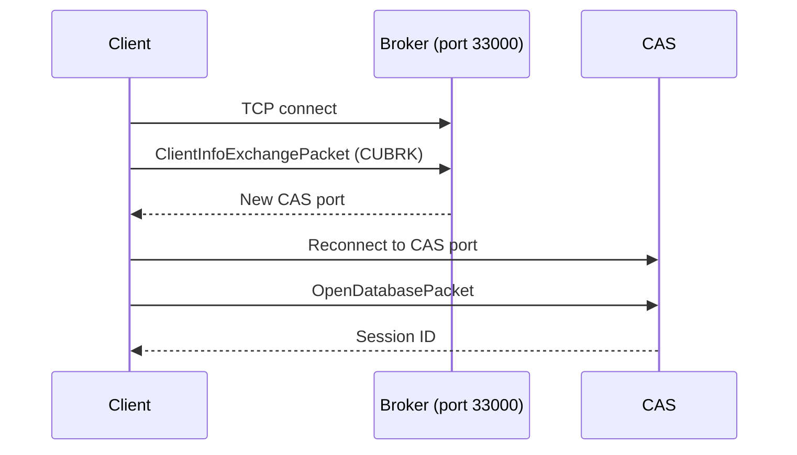
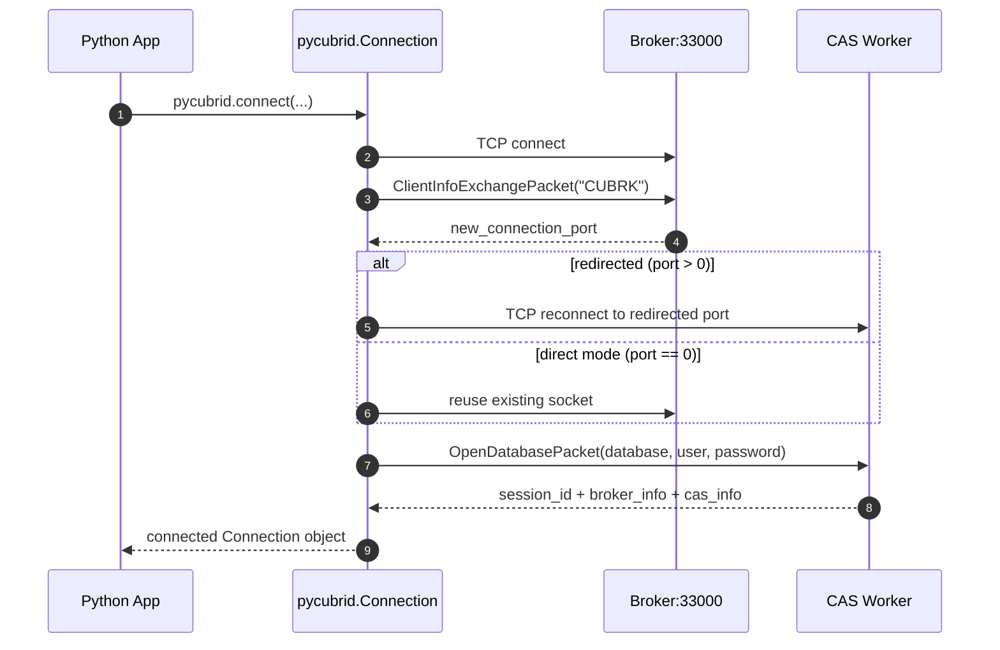

# Connection Guide

This guide covers how to install pycubrid, connect to a CUBRID database, and understand the connection lifecycle.

---

## Table of Contents

- [Prerequisites](#prerequisites)
- [Installation](#installation)
- [Connection Function](#connection-function)
- [Connection Examples](#connection-examples)
- [Context Manager Protocol](#context-manager-protocol)
- [Autocommit Mode](#autocommit-mode)
- [Connection Methods](#connection-methods)
- [Broker Handshake](#broker-handshake)
- [Server Version Detection](#server-version-detection)
- [Troubleshooting](#troubleshooting)
- [Docker Quick Start](#docker-quick-start)
- [SQLAlchemy Integration](#sqlalchemy-integration)

---

## Prerequisites

| Requirement   | Version    |
|---------------|------------|
| Python        | 3.10+      |
| CUBRID Server | 10.2–11.4  |

No C compiler or native libraries required — pycubrid is pure Python.

!!! tip
    For local development, start with `host="localhost"`, `port=33000`, `user="dba"`, and empty password unless your environment is hardened.

---

## Installation

### From PyPI

```bash
pip install pycubrid
```

### From Source

```bash
git clone https://github.com/cubrid-lab/pycubrid.git
cd pycubrid
pip install -e ".[dev]"
```

---

## Connection Function

```python
def connect(
    host: str = "localhost",
    port: int = 33000,
    database: str = "",
    user: str = "dba",
    password: str = "",
    decode_collections: bool = False,
    json_deserializer: Any = None,
    ssl: bool | ssl_module.SSLContext | None = None,
    **kwargs: Any,
) -> Connection
```

### Parameters

| Parameter | Type | Default | Description |
|---|---|---|---|
| `host` | `str` | `"localhost"` | CUBRID server hostname or IP address |
| `port` | `int` | `33000` | CUBRID broker port |
| `database` | `str` | `""` | Database name *(required)* |
| `user` | `str` | `"dba"` | Database username |
| `password` | `str` | `""` | Database password |
| `decode_collections` | `bool` | `False` | Decode SET/MULTISET/SEQUENCE columns into Python collections |
| `json_deserializer` | `Any` | `None` | Callable used to decode JSON columns on fetch; when unset JSON is returned as `str` |
| `ssl` | `bool \| ssl_module.SSLContext \| None` | `None` | Opt-in TLS for sync broker connections |

### Keyword Arguments

| Kwarg | Type | Default | Description |
|---|---|---|---|
| `connect_timeout` | `float` | `None` | Socket connection timeout in seconds |
| `read_timeout` | `float` | `None` | Socket read timeout in seconds |
| `fetch_size` | `int` | `100` | Server-side fetch batch size |
| `enable_timing` | `bool \| None` | `None` | Enable driver timing stats, or fall back to `PYCUBRID_ENABLE_TIMING` |
| `no_backslash_escapes` | `bool` | `False` | Escape strings using doubled quotes only, without backslash escapes |
| `autocommit` | `bool` | `False` | Enable immediate commit per statement |

### Common Connection Profiles

| Profile | host | port | user | password | autocommit | Use case |
|---|---|---:|---|---|---|---|
| Local default | `localhost` | `33000` | `dba` | `""` | `False` | Development and smoke tests |
| Remote app | `db.example.com` | `33000` | `app_user` | required | `False` | Production service workloads |
| Script mode | any | any | any | any | `True` | One-off migration/maintenance scripts |

### Return Value

Returns a `Connection` object implementing PEP 249.

---

## Connection Examples

### Basic Connection

```python
import pycubrid

conn = pycubrid.connect(
    host="localhost",
    port=33000,
    database="testdb",
    user="dba",
)

cur = conn.cursor()
cur.execute("SELECT 1 + 1")
print(cur.fetchone())  # (2,)

cur.close()
conn.close()
```

!!! warning
    The `database` argument is required in real environments. Empty database names can fail at `OpenDatabasePacket` stage depending on server configuration.

### With Password

```python
conn = pycubrid.connect(
    host="localhost",
    port=33000,
    database="demodb",
    user="dba",
    password="mypassword",
)
```

### Custom Port and Timeout

```python
conn = pycubrid.connect(
    host="db-server.internal",
    port=33100,
    database="production",
    user="app_user",
    password="secret",
    connect_timeout=10.0,  # 10-second timeout
)
```

!!! note
    If you run behind firewalls or load balancers, set `connect_timeout` explicitly and monitor for broker redirection failures.

### SSL/TLS

```python
import pycubrid

conn = pycubrid.connect(
    host="db.example.com",
    port=33000,
    database="production",
    user="app_user",
    password="secret",
    ssl=True,
)
```

- `ssl=True` creates a verified default `ssl.SSLContext` using system trust roots.
- When `ssl=True`, pycubrid sets `SSLContext.minimum_version = ssl.TLSVersion.TLSv1_2` on the default context for both sync and async connections.
- `ssl=your_ssl_context` uses your custom context directly, which is useful for self-signed or private CA certificates.
- `ssl=None` or `ssl=False` disables TLS and preserves the previous plaintext behavior.

Both `pycubrid.connect()` and `pycubrid.aio.connect()` accept the same `ssl` values:

- `ssl=True` for the default verified context with a TLS 1.2 minimum.
- `ssl=False` or `ssl=None` for plaintext.
- `ssl=your_ssl_context` for a custom `ssl.SSLContext`.

Async TLS uses `asyncio.open_connection(..., ssl=...)` internally, and async shutdown awaits
`writer.wait_closed()` so TLS sessions close cleanly.

```python
import pycubrid.aio

conn = await pycubrid.aio.connect(
    host="db.example.com",
    port=33000,
    database="production",
    user="app_user",
    password="secret",
    ssl=True,
)
```

!!! note
    CUBRID broker TLS must be enabled on the server side (`SSL=ON` in `cubrid_broker.conf`) before TLS connections can succeed.

### Async Health Checks

Async connections expose the same lightweight native health check as sync connections:

```python
import pycubrid.aio

conn = await pycubrid.aio.connect(database="testdb")

alive = await conn.ping(reconnect=False)
if not alive:
    await conn.ping(reconnect=True)
```

- `await conn.ping(reconnect=False)` always issues the native `CHECK_CAS` round-trip when the socket is open, but suppresses the implicit broker-handoff reconnect that fires on a normal post-commit `CAS_INFO=INACTIVE` state. Returns `False` only if the socket is closed or `CHECK_CAS` itself fails — making it safe for SQLAlchemy's `pool_pre_ping`.
- `await conn.ping(reconnect=True)` attempts close + reconnect on socket/protocol failure before returning `False`.
- The async implementation uses the same native `CHECK_CAS` function code (`FC=32`) as sync `Connection.ping()` and does not execute SQL.

---

## Context Manager Protocol

pycubrid connections support the `with` statement for automatic resource management:

```python
import pycubrid

with pycubrid.connect(
    host="localhost",
    port=33000,
    database="testdb",
    user="dba",
) as conn:
    cur = conn.cursor()
    cur.execute("INSERT INTO cookbook_users (name) VALUES (?)", ("Alice",))
    # Connection commits automatically on success
# Connection is closed automatically after exiting the block
```

### Behavior

| Scenario          | Action                                  |
|-------------------|-----------------------------------------|
| No exception      | `conn.commit()` then `conn.close()`     |
| Exception raised  | `conn.rollback()` then `conn.close()`   |

The `__enter__` method returns the connection itself. The `__exit__` method:

1. Commits the transaction if no exception occurred
2. Rolls back the transaction if an exception was raised
3. Always closes the connection

### Manual Transaction Control

If you need explicit control, manage transactions directly:

```python
conn = pycubrid.connect(host="localhost", port=33000, database="testdb", user="dba")
try:
    cur = conn.cursor()
    cur.execute("INSERT INTO cookbook_logs (msg) VALUES (?)", ("event",))
    conn.commit()
except Exception:
    conn.rollback()
    raise
finally:
    conn.close()
```

---

## Autocommit Mode

The `autocommit` property controls whether each statement is committed automatically.

```python
# Check current mode
print(conn.autocommit)  # False (driver default)

# Disable autocommit for transaction grouping
conn.autocommit = False

# Re-enable autocommit
conn.autocommit = True
```

### Details

| Property | Description |
|---|---|
| Default value | `False` |
| Getter | Returns current autocommit state |
| Setter (`= True`) | Sends `SetDbParameterPacket` + `CommitPacket` to server |
| Setter (`= False`) | Sends `SetDbParameterPacket` + `CommitPacket` to server |

> **Note**: When using pycubrid with SQLAlchemy (`cubrid+pycubrid://`), the dialect sets
> `autocommit = False` on each new connection so SQLAlchemy can manage transactions properly.
>
> The CUBRID server default is `autocommit=True`, but pycubrid `Connection` defaults to
> `autocommit=False` for explicit transaction control. Pass `autocommit=True` to `connect()`
> to enable.

---

## Connection Methods

| Method                              | Return Type   | Description                                     |
|-------------------------------------|---------------|-------------------------------------------------|
| `cursor()`                          | `Cursor`      | Create a new cursor for executing SQL            |
| `commit()`                          | `None`        | Commit the current transaction                   |
| `rollback()`                        | `None`        | Roll back the current transaction                |
| `close()`                           | `None`        | Close the connection and free resources           |
| `get_server_version()`              | `str`         | Return the CUBRID server version string          |
| `get_last_insert_id()`              | `str`         | Return the last auto-increment ID                |
| `create_lob(lob_type)`              | `Lob`         | Create a new LOB object (CLOB=24, BLOB=23)       |
| `get_schema_info(schema_type, ...)` | `GetSchemaPacket` | Query schema metadata from the server |

### LOB Creation

```python
# Create a CLOB (Character Large Object)
clob = conn.create_lob(24)  # 24 = CLOB
clob.write(b"Large text content...")

# Create a BLOB (Binary Large Object)
blob = conn.create_lob(23)  # 23 = BLOB
blob.write(b"\x89PNG\r\n...")
```

> **Tip**: `Lob.write()` accepts `bytes` only. For ordinary CLOB inserts, prefer direct SQL
> parameter binding with `str`; for BLOB inserts, pass `bytes` directly. See [Examples](EXAMPLES.md)
> for details.

### Schema Information

```python
# Get schema information (schema_type constants from CUBRID docs)
packet = conn.get_schema_info(schema_type=1)  # Tables
print(packet.tuple_count)
```

---

## Broker Handshake

When `pycubrid.connect()` is called, the following protocol handshake occurs:





!!! danger
    If broker redirection returns a CAS port not reachable from your client network, connection succeeds at step 1 but fails before session establishment.

### Step-by-Step

1. **TCP Connect** — Open a socket to the broker (default port 33000)
2. **Client Info Exchange** — Send the magic string `b"CUBRK"` with client type `CLIENT_JDBC=3` and protocol version bytes
3. **Port Redirect** — The broker responds with a 4-byte big-endian integer:
   - If `port > 0`: Disconnect from broker, reconnect to the new CAS port on the same host
   - If `port == 0`: Reuse the existing connection (direct CAS mode)
4. **Open Database** — Send database name, username, and password via `OpenDatabasePacket`
5. **Session Established** — Server returns a session ID; the connection is ready

---

## Server Version Detection

```python
conn = pycubrid.connect(host="localhost", port=33000, database="testdb", user="dba")
version = conn.get_server_version()
print(version)  # e.g., "11.2.0.0374"
conn.close()
```

The `get_server_version()` method sends a `GetEngineVersionPacket` to the server and returns the version as a string.

---

## Troubleshooting

### Common Connection Errors

#### `ConnectionRefusedError` on port 33000

The CUBRID broker is not running or not listening on the expected port.

1. Verify the broker is running:
   ```bash
   cubrid broker status
   ```
2. Check the broker port in `cubrid_broker.conf` (default: 33000)
3. If using Docker:
   ```bash
   docker compose up -d
   docker compose logs cubrid
   ```

#### `Authentication failed`

CUBRID's default `dba` user has no password. If you set one, ensure it matches:

```python
# If dba has no password
conn = pycubrid.connect(host="localhost", port=33000, database="testdb", user="dba")

# If dba has a password
conn = pycubrid.connect(host="localhost", port=33000, database="testdb", user="dba", password="mypassword")
```

#### `TimeoutError` or `socket.timeout`

The server did not respond within the timeout period:

```python
# Increase timeout
conn = pycubrid.connect(
    host="slow-server.example.com",
    port=33000,
    database="testdb",
    user="dba",
    connect_timeout=30.0,
)
```

#### `OperationalError: Connection is closed`

The connection was closed by the server (session timeout, network interruption, or broker restart). Create a new connection:

```python
conn = pycubrid.connect(host="localhost", port=33000, database="testdb", user="dba")
```

---

## Docker Quick Start

For local development, use the provided `docker-compose.yml`:

```bash
# Start CUBRID 11.2 (default)
docker compose up -d

# Start a specific version
CUBRID_VERSION=11.4 docker compose up -d

# Verify it's running
docker compose ps

# Connect with pycubrid
python3 -c "
import pycubrid
with pycubrid.connect(host='localhost', port=33000, database='testdb', user='dba') as conn:
    cur = conn.cursor()
    cur.execute('SELECT 1 + 1')
    print(cur.fetchone())
"

# Stop and clean up
docker compose down -v
```

---

## SQLAlchemy Integration

pycubrid works as a driver for [sqlalchemy-cubrid](https://github.com/cubrid-lab/sqlalchemy-cubrid):

```bash
pip install "sqlalchemy-cubrid[pycubrid]"
```

```python
from sqlalchemy import create_engine, text

engine = create_engine("cubrid+pycubrid://dba@localhost:33000/testdb")

with engine.connect() as conn:
    result = conn.execute(text("SELECT 1"))
    print(result.scalar())
```

SQLAlchemy features — ORM, Core, Alembic migrations, schema reflection — are accessible through the pycubrid driver when used with sqlalchemy-cubrid.

---

## Connection Pooling

pycubrid does not include a built-in connection pool. Each `pycubrid.connect()` call creates a new TCP connection to the CUBRID broker.

For connection pooling, use one of:

- **SQLAlchemy's built-in pool** (recommended):
  ```python
  from sqlalchemy import create_engine
  engine = create_engine(
      "cubrid+pycubrid://dba@localhost:33000/testdb",
      pool_size=5,
      pool_pre_ping=True,
  )
  ```

- **External pooling libraries** (e.g., `sqlalchemy.pool`, `DBUtils`)

See [Troubleshooting](TROUBLESHOOTING.md) for pool tuning guidance.

---

## Character Encoding

pycubrid operates exclusively in **UTF-8** encoding. This matches CUBRID's internal
character set — the server stores and returns string data as UTF-8.

There is no `charset` connection parameter. All string encoding/decoding in the
wire protocol uses UTF-8 unconditionally:

- Python `str` values are encoded to UTF-8 bytes before sending to the server
- Byte responses from the server are decoded as UTF-8 to produce Python `str` values

This is intentional and covers all CUBRID string types (`VARCHAR`, `CHAR`, `STRING`,
`CLOB`). If your application deals with non-UTF-8 data, encode/decode at the
application layer before passing values to pycubrid.

!!! note
    CUBRID's default charset is `utf8` (set at database creation). All modern CUBRID
    installations use UTF-8. Legacy databases created with `iso88591` charset may
    produce garbled strings for non-ASCII data, since pycubrid always decodes bytes
    as UTF-8.

---

*See also: [Type System](TYPES.md) · [API Reference](API_REFERENCE.md) · [Examples](EXAMPLES.md)*
