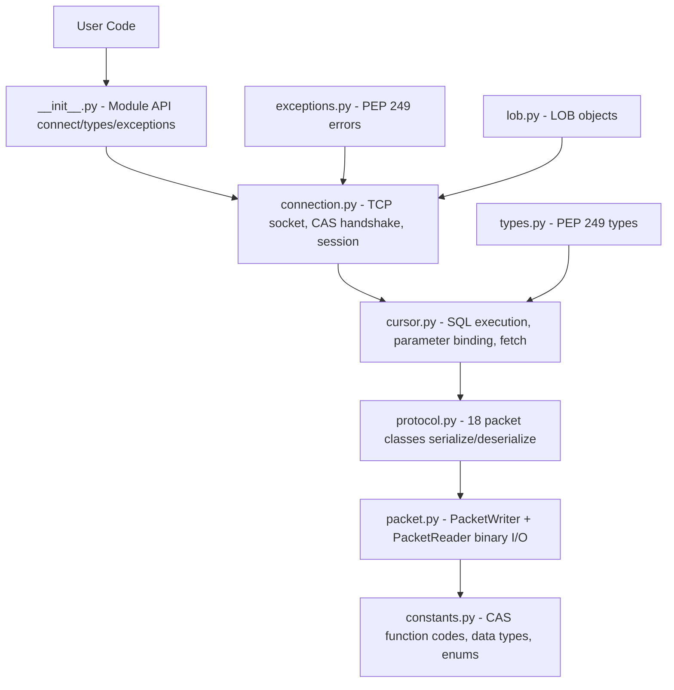

# Development Guide

Everything you need to set up, test, and contribute to pycubrid.

---

## Table of Contents

- [Prerequisites](#prerequisites)
- [Installation](#installation)
- [Project Structure](#project-structure)
- [Running Tests](#running-tests)
  - [Offline Tests](#offline-tests)
  - [Integration Tests](#integration-tests)
  - [Code Coverage](#code-coverage)
- [Docker Setup](#docker-setup)
- [Code Style](#code-style)
- [Makefile Commands](#makefile-commands)
- [CI/CD](#cicd)
- [Architecture Overview](#architecture-overview)
- [Adding a New Packet Type](#adding-a-new-packet-type)
- [Adding a New Data Type](#adding-a-new-data-type)
- [Release Process](#release-process)

---

## Prerequisites

| Requirement   | Version  | Notes |
|---------------|----------|-------|
| Python        | 3.10+    | Uses `X | Y` union syntax, `match` statements |
| Docker        | Latest   | Only for integration tests |
| CUBRID Server | 10.2–11.4 | Via Docker or local install |

---

## Installation

```bash
# Clone the repository
git clone https://github.com/cubrid-lab/pycubrid.git
cd pycubrid

# Install in development mode with dev dependencies
pip install -e ".[dev]"

# Or use the Makefile
make install
```

### Dev Dependencies

| Package     | Purpose |
|-------------|---------|
| `pytest`    | Test framework |
| `pytest-cov`| Coverage reporting |
| `ruff`      | Linter and formatter |

---

## Project Structure

```mermaid
graph TD
    root[pycubrid/]

    pkg[pycubrid/ - Main package (9 modules)]
    tests[tests/ - Test suite]
    docs[docs/ - Documentation]
    pyproject[pyproject.toml - Package configuration]
    makefile[Makefile - Development commands]
    compose[docker-compose.yml - CUBRID container setup]
    changelog[CHANGELOG.md - Release history]
    contributing[CONTRIBUTING.md - Contribution guidelines]
    license[LICENSE - MIT license]
    readme[README.md - Project overview]

    root --> pkg
    root --> tests
    root --> docs
    root --> pyproject
    root --> makefile
    root --> compose
    root --> changelog
    root --> contributing
    root --> license
    root --> readme

    pkg --> init[__init__.py - Public API, PEP 249 module attributes]
    pkg --> connection[connection.py - Connection class (TCP, CAS handshake)]
    pkg --> cursor[cursor.py - Cursor class (execute, fetch, iterate)]
    pkg --> types[types.py - PEP 249 type objects and constructors]
    pkg --> exceptions[exceptions.py - Full PEP 249 exception hierarchy]
    pkg --> constants[constants.py - CAS protocol enums (41 function codes, 27+ types)]
    pkg --> protocol[protocol.py - 18 packet classes (serialize/deserialize)]
    pkg --> packet[packet.py - PacketWriter + PacketReader primitives]
    pkg --> lob[lob.py - LOB (BLOB/CLOB) support]
    pkg --> typed[py.typed - PEP 561 marker]

    tests --> conftest[conftest.py - Shared fixtures (mock connection, mock socket)]
    tests --> test_connection[test_connection.py - Connection lifecycle tests]
    tests --> test_cursor[test_cursor.py - Cursor operations tests]
    tests --> test_types[test_types.py - Type object tests]
    tests --> test_exceptions[test_exceptions.py - Exception hierarchy tests]
    tests --> test_constants[test_constants.py - Constants enumeration tests]
    tests --> test_protocol[test_protocol.py - Packet serialization/deserialization tests]
    tests --> test_packet[test_packet.py - PacketWriter/PacketReader tests]
    tests --> test_lob[test_lob.py - LOB tests]
    tests --> test_pep249[test_pep249.py - PEP 249 compliance tests]
    tests --> test_integration[test_integration.py - Live DB integration tests (requires Docker)]
    tests --> test_suite[test_suite.py - Extended test suite]

    docs --> doc_connection[CONNECTION.md - Connection guide]
    docs --> doc_types[TYPES.md - Type system reference]
    docs --> doc_api[API_REFERENCE.md - Complete API documentation]
    docs --> doc_protocol[PROTOCOL.md - CAS protocol reference]
    docs --> doc_dev[DEVELOPMENT.md - This file]
    docs --> doc_examples[EXAMPLES.md - Usage examples]
```

---

## Running Tests

### Offline Tests

Most tests are **offline** — they mock the CUBRID connection and test packet serialization, cursor logic, type mapping, and exception handling without a database.

```bash
# Run all offline tests with coverage
pytest tests/ -v --ignore=tests/test_integration.py \
  --cov=pycubrid --cov-report=term-missing --cov-fail-under=95

# Or use the Makefile
make test
```

### Integration Tests

Integration tests require a running CUBRID instance. Use Docker:

```bash
# Start CUBRID
docker compose up -d

# Set connection URL
export CUBRID_TEST_URL="cubrid://dba@localhost:33000/testdb"

# Run integration tests
pytest tests/test_integration.py -v

# Cleanup
docker compose down -v
```

#### Async TLS integration tests

`tests/test_aio_ssl_integration.py` adds async TLS coverage for `pycubrid.aio`.
The repository's default `docker-compose.yml` starts a plaintext broker only, so
these tests are skipped unless you point them at a separate TLS-enabled broker.

Export the normal integration variables plus these TLS overrides as needed:

```bash
export CUBRID_TLS_TEST_HOST=localhost
export CUBRID_TLS_TEST_PORT=33001
export CUBRID_TLS_TEST_DB=testdb
export CUBRID_TLS_TEST_USER=dba
export CUBRID_TLS_TEST_PASSWORD=

# Optional: private CA bundle for ssl.SSLContext/load_verify_locations().
export CUBRID_TLS_TEST_CA_FILE="$PWD/certs/ca.pem"

# Optional: alternate reachable host/IP for hostname-mismatch coverage.
export CUBRID_TLS_TEST_MISMATCH_HOST=127.0.0.1

# If test_aio_ssl_connect_default_context uses a private CA, also point the
# process default trust store at that CA before running pytest.
export SSL_CERT_FILE="$CUBRID_TLS_TEST_CA_FILE"
```

Broker-side TLS must already be enabled (`SSL=ON` in `cubrid_broker.conf`) and
the broker certificate must match `CUBRID_TLS_TEST_HOST`. Then run:

```bash
pytest tests/test_aio_ssl_integration.py -v
```

##### Automated TLS coverage in CI

You do not need to run the steps above locally for routine development —
`.github/workflows/integration-full.yml` includes an `integration-tls` job
(Python {3.10, 3.14} × CUBRID 11.4) that:

1. Starts a CUBRID 11.4 container manually (so the broker config can be
   patched after the container is up).
2. Flips `SSL=OFF` → `SSL=ON` for `BROKER1` and restarts the broker.
3. Copies the default self-signed broker certificate out of the container.
4. Probes the broker with a real TLS handshake and fails the job loudly
   if TLS is not actually serving — silent skips are explicitly rejected.
5. Runs `tests/test_aio_ssl_integration.py` against the TLS broker with
   the `CUBRID_TLS_TEST_*` env vars wired up automatically.

This job runs on the same triggers as the rest of `integration-full`
(nightly, on tag push, and via `workflow_dispatch`).

### Code Coverage

Current test metrics:

| Metric | Value |
|--------|-------|
| Offline tests | 471 |
| Integration tests | 41 |
| Statement coverage | 99.88% |
| Statements | 1,134 |
| Missed | 1 |
| CI threshold | 95% |

```bash
# Generate HTML coverage report
pytest tests/ --ignore=tests/test_integration.py \
  --cov=pycubrid --cov-report=html

# Open in browser
open htmlcov/index.html
```

---

## Docker Setup

### docker-compose.yml

```yaml
services:
  cubrid:
    image: cubrid/cubrid:11.2
    container_name: cubrid-test
    ports:
      - "33000:33000"
    environment:
      CUBRID_DB: testdb
```

### Commands

```bash
# Start with default CUBRID 11.2
docker compose up -d

# Start with specific version
CUBRID_VERSION=11.4 docker compose up -d

# Check container status
docker compose ps

# View logs
docker compose logs -f cubrid

# Stop and cleanup
docker compose down -v
```

### Connection Details

| Parameter | Value |
|-----------|-------|
| Host | `localhost` |
| Port | `33000` |
| Database | `testdb` |
| User | `dba` |
| Password | (empty) |

---

## Code Style

### Ruff Configuration

```toml
[tool.ruff]
line-length = 100
target-version = "py310"
```

### Conventions

- **Imports**: `from __future__ import annotations` in every module
- **Type hints**: Full typing; PEP 561 compliant (`py.typed`)
- **super()**: Always `super().__init__()`, never `super(ClassName, self)`
- **Line length**: 100 characters
- **Docstrings**: Google-style for all public methods and classes
- **Naming**:
  - Classes: `PascalCase` (e.g., `PacketWriter`, `ColumnMetaData`)
  - Private methods: `_underscore_prefix` (e.g., `_parse_byte`, `_write_int`)
  - Constants: `UPPER_SNAKE_CASE` (e.g., `CAS_INFO`, `DATA_LENGTH`)

### Linting

```bash
# Check for issues
make lint

# Auto-fix
make format

# Or manually
ruff check pycubrid/ tests/
ruff format pycubrid/ tests/
```

### Anti-Patterns (Never Do)

- No f-string interpolation in SQL queries (SQL injection risk)
- No `super(ClassName, self)` — use `super()` only
- No Python 2 constructs
- No empty `except` blocks (except in cleanup paths like `close()`)
- No type suppression (`# type: ignore` without explanation)

---

## Makefile Commands

| Command | Description |
|---------|-------------|
| `make install` | Install in dev mode with all dependencies |
| `make test` | Run offline tests with coverage |
| `make lint` | Run ruff check + format check |
| `make format` | Auto-fix lint and formatting issues |
| `make integration` | Docker → integration tests → cleanup |
| `make clean` | Remove build artifacts |

---

## CI/CD

### GitHub Actions Workflows

| Workflow | Trigger | Description |
|----------|---------|-------------|
| `ci.yml` | Push to main, PRs | Lint + offline tests (Python 3.10–3.13) + integration |
| `python-publish.yml` | GitHub Release | Build and publish to PyPI |

### CI Matrix

- **Offline**: Python 3.10, 3.11, 3.12, 3.13
- **Integration**: Python {3.10, 3.12} × CUBRID {11.2, 11.4}

---

## Architecture Overview



### Data Flow

1. **User** calls `cursor.execute("SELECT ...")`
2. **Cursor** binds parameters, creates `PrepareAndExecutePacket`
3. **Connection** calls `_send_and_receive(packet)`
4. **PacketWriter** serializes the request with protocol header
5. **Socket** sends bytes to CAS server
6. **Socket** receives response bytes
7. **PacketReader** deserializes the response
8. **Packet** parses column metadata and row data
9. **Cursor** stores rows for `fetchone()`/`fetchall()`

---

## Adding a New Packet Type

To add a new CAS function:

1. **Add the function code** to `CASFunctionCode` in `constants.py`:

   ```python
   class CASFunctionCode(IntEnum):
       # ... existing codes ...
       MY_NEW_FUNCTION = 42
   ```

2. **Create the packet class** in `protocol.py`:

   ```python
   class MyNewPacket:
       """Description (FC=42)."""

       def __init__(self, arg1: int) -> None:
           self.arg1 = arg1
           self.result: str = ""

       def write(self, cas_info: bytes) -> bytes:
           writer = PacketWriter()
           writer._write_byte(CASFunctionCode.MY_NEW_FUNCTION)
           writer.add_int(self.arg1)
           payload = writer.to_bytes()
           header = build_protocol_header(len(payload), cas_info)
           return header + payload

       def parse(self, data: bytes) -> None:
           reader = PacketReader(data)
           _ = reader._parse_bytes(DataSize.CAS_INFO)
           response_code = reader._parse_int()
           if response_code < 0:
               remaining = len(data) - 8
               _raise_error(reader, remaining)
           # Parse result-specific data
           self.result = reader._parse_null_terminated_string(response_code)
   ```

3. **Add tests** in `tests/test_protocol.py`:

   ```python
   def test_my_new_packet_write():
       packet = MyNewPacket(arg1=42)
       data = packet.write(b"\x00\x00\x00\x00")
       assert len(data) > 8  # Header + payload
   ```

---

## Adding a New Data Type

To support a new CUBRID data type:

1. **Add the type code** to `CUBRIDDataType` in `constants.py`
2. **Add the reader** in `_read_value()` in `protocol.py`
3. **Add the writer** in `PacketWriter` in `packet.py` (if needed)
4. **Add tests** for both reading and writing

---

## Release Process

1. Update version in `pyproject.toml` and `pycubrid/__init__.py`
2. Add changelog entry in `CHANGELOG.md`
3. Commit: `git commit -m "chore: bump version to X.Y.Z"`
4. Tag: `git tag vX.Y.Z`
5. Push: `git push origin main --tags`
6. Create GitHub release: `gh release create vX.Y.Z`
7. PyPI publish triggers automatically from the release workflow
