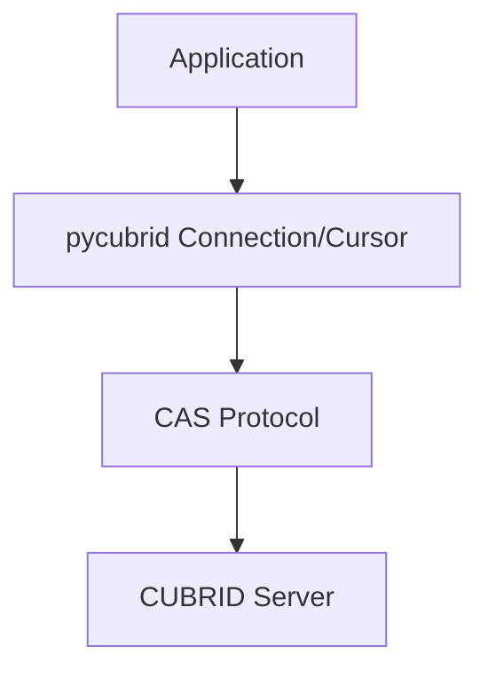

# pycubrid

**Reiner Python-DB-API-2.0-Treiber für die CUBRID-Datenbank** — ohne C-Erweiterungen, ohne Kompilierung, implementiert die PEP-249-(DB-API-2.0)-Schnittstelle.

[🇰🇷 한국어](README.ko.md) · [🇺🇸 English](../README.md) · [🇨🇳 中文](README.zh.md) · [🇮🇳 हिन्दी](README.hi.md) · [🇩🇪 Deutsch](README.de.md) · [🇷🇺 Русский](README.ru.md)

<!-- BADGES:START -->
[](https://pypi.org/project/pycubrid)
[](https://www.python.org)
[](https://github.com/cubrid-lab/pycubrid/actions/workflows/ci.yml)
[](https://github.com/cubrid-lab/pycubrid/actions/workflows/integration-full.yml)
[](https://codecov.io/gh/cubrid-lab/pycubrid)
[](https://github.com/cubrid-lab/pycubrid/blob/main/LICENSE)
[](https://github.com/cubrid-lab/pycubrid)
[](https://cubrid-lab.github.io/pycubrid/)
<!-- BADGES:END -->

---

> **Status: Beta.** Die zentrale öffentliche API folgt Semantic Versioning; Minor-Releases können zusätzliche Funktionen und Fehlerbehebungen enthalten, solange sich das Projekt noch in aktiver Entwicklung befindet.

## Warum pycubrid?

CUBRID ist eine leistungsstarke relationale Open-Source-Datenbank, die in
koreanischen Behörden und Unternehmensanwendungen weit verbreitet ist. Der
bestehende C-Erweiterungstreiber (`CUBRIDdb`) hatte Build-Abhängigkeiten und
Probleme bei der Plattformkompatibilität.

**pycubrid** löst diese Probleme:

- **Reine Python-Implementierung** — keine C-Build-Abhängigkeiten, Installation nur mit `pip install`
- **Implementiert PEP 249 (DB-API 2.0)** — Standard-Ausnahmehierarchie, Typobjekte und Cursor-Schnittstelle
- **770 Offline-Tests / 811 insgesamt** mit **97,29 % Codeabdeckung** — die meisten Tests laufen ohne Datenbank
- **TLS/SSL für synchrone und asynchrone Verbindungen** — optional `ssl=True` (verifizierter Kontext, TLS 1.2 Minimum) oder ein benutzerdefiniertes `ssl.SSLContext` bei `connect()` und `pycubrid.aio.connect()`
- **Native asyncio-Unterstützung** — Async/Await-API über `pycubrid.aio` für Anwendungen mit hoher Parallelität
- **PEP-561-typisiertes Paket** — `py.typed`-Marker für moderne IDEs und statische Analysewerkzeuge
- **Direkte Implementierung des CUBRID-CAS-Protokolls** — keine zusätzliche Middleware erforderlich
- **LOB-Unterstützung (CLOB/BLOB)** — Verarbeitung großer Text- und Binärdaten

## Anforderungen

- Python 3.10+
- CUBRID-Datenbankserver 10.2+

## Installation

```bash
pip install pycubrid
```

## Schnellstart

### Grundlegende Verbindung

```python
import pycubrid

conn = pycubrid.connect(
    host="localhost",
    port=33000,
    database="testdb",
    user="dba",
    password="",
)

cur = conn.cursor()
cur.execute("SELECT 1 + 1")
print(cur.fetchone())  # (2,)

cur.close()
conn.close()
```

### Kontextmanager

```python
import pycubrid

with pycubrid.connect(host="localhost", port=33000, database="testdb", user="dba") as conn:
    with conn.cursor() as cur:
        cur.execute("CREATE TABLE IF NOT EXISTS cookbook_users (id INT AUTO_INCREMENT PRIMARY KEY, name VARCHAR(100))")
        cur.execute("INSERT INTO cookbook_users (name) VALUES (?)", ("Alice",))
        conn.commit()

        cur.execute("SELECT * FROM cookbook_users")
        for row in cur:
            print(row)
```

### Async

```python
import asyncio
import pycubrid.aio

async def main():
    conn = await pycubrid.aio.connect(
        host="localhost", port=33000, database="testdb", user="dba"
    )
    cur = conn.cursor()
    await cur.execute("SELECT 1 + 1")
    print(await cur.fetchone())  # (2,)
    await cur.close()
    await conn.close()

asyncio.run(main())
```

### Parameterbindung

```python
# qmark-Stil (Fragezeichen)
cur.execute("SELECT * FROM users WHERE name = ? AND age > ?", ("Alice", 25))

# Batch-Insert mit executemany
data = [("Alice", 30), ("Bob", 25), ("Charlie", 35)]
cur.executemany("INSERT INTO users (name, age) VALUES (?, ?)", data)
conn.commit()
```

### Parametrisierte Abfragen

```python
sql = "SELECT * FROM users WHERE department = ?"

cur.execute(sql, ("Engineering",))
engineers = cur.fetchall()

cur.execute(sql, ("Marketing",))
marketers = cur.fetchall()
```

## PEP-249-Konformität

| Attribut | Wert |
|---|---|
| `apilevel` | `"2.0"` |
| `threadsafety` | `1` (Verbindungen dürfen nicht zwischen Threads geteilt werden) |
| `paramstyle` | `"qmark"` (Positionsparameter `?`) |

- Vollständige Standard-Ausnahmehierarchie: `Warning`, `Error`, `InterfaceError`, `DatabaseError`, `OperationalError`, `IntegrityError`, `InternalError`, `ProgrammingError`, `NotSupportedError`
- Standard-Typobjekte: `STRING`, `BINARY`, `NUMBER`, `DATETIME`, `ROWID`
- Standard-Konstruktoren: `Date()`, `Time()`, `Timestamp()`, `Binary()`, `DateFromTicks()`, `TimeFromTicks()`, `TimestampFromTicks()`

## Funktionen

- **Reines Python** — keine C-Erweiterungen, keine Kompilierung, läuft überall dort, wo Python läuft
- **Vollständiges DB-API 2.0** — `connect()`, `Cursor`, `fetchone/many/all`, `executemany`, `callproc`
- **Parametrisierte Abfragen** — `cursor.execute(sql, params)` mit serverseitigem `PREPARE_AND_EXECUTE`
- **Batch-Operationen** — `executemany()` und `executemany_batch()` für Masseneinfügungen
- **LOB-Unterstützung** — `create_lob()`, Lesen/Schreiben von CLOB- und BLOB-Spalten
- **Schema-Introspektion** — `get_schema_info()` für Tabellen, Spalten, Indizes und Constraints
- **Auto-Commit-Steuerung** — Eigenschaft `connection.autocommit` für das Transaktionsmanagement
- **Serverversionserkennung** — `connection.get_server_version()` liefert einen Versionsstring (z. B. `"11.2.0.0378"`)
- **Iterator-Protokoll** — Cursor-Ergebnisse mit `for row in cursor` durchlaufen
- **Kontextmanager** — `with`-Anweisungen für Verbindungen und Cursor
- **Async-Unterstützung** — `pycubrid.aio.connect()` mit `AsyncConnection` und `AsyncCursor` für asyncio-Event-Loops

## Unterstützte CUBRID-Versionen

Das Projekt richtet sich an CUBRID 10.x und 11.x und wird in CI gegen folgende Versionen validiert:

- 10.2
- 11.0
- 11.2
- 11.4

## SQLAlchemy-Integration

pycubrid funktioniert als Treiber für [sqlalchemy-cubrid](https://github.com/cubrid-lab/sqlalchemy-cubrid) — den SQLAlchemy-2.0-Dialekt für CUBRID:

```bash
pip install "sqlalchemy-cubrid[pycubrid]"
```

```python
from sqlalchemy import create_engine, text

engine = create_engine("cubrid+pycubrid://dba@localhost:33000/testdb")

with engine.connect() as conn:
    result = conn.execute(text("SELECT 1"))
    print(result.scalar())
```

SQLAlchemy-Funktionen (ORM, Core, Alembic-Migrationen, Schema-Reflexion) sind über den pycubrid-Treiber verfügbar, wenn er mit sqlalchemy-cubrid verwendet wird.

## Dokumentation

| Leitfaden | Beschreibung |
|---|---|
| [Verbindung](CONNECTION.md) | Verbindungszeichenfolgen, URL-Format, Konfiguration |
| [Typzuordnung](TYPES.md) | Vollständige Typzuordnung, CUBRID-spezifische Typen, Sammlungstypen |
| [API-Referenz](API_REFERENCE.md) | Vollständige API-Dokumentation — Module, Klassen, Funktionen |
| [Protokoll](PROTOCOL.md) | Referenz zum CAS-Wire-Protokoll |
| [Entwicklung](DEVELOPMENT.md) | Entwicklungsumgebung, Tests, Docker, Abdeckung, CI/CD |
| [Beispiele](EXAMPLES.md) | Praktische Anwendungsbeispiele mit Code |
| [Fehlerbehebung](TROUBLESHOOTING.md) | Verbindungsfehler, Abfrageprobleme, LOB-Behandlung, Debugging |

## Kompatibilität

| | Python 3.10 | Python 3.11 | Python 3.12 | Python 3.13 | Python 3.14 |
|---|:---:|:---:|:---:|:---:|:---:|
| **Offline-Tests** | ✅ | ✅ | ✅ | ✅ | ✅ |
| **CUBRID 11.4** | ✅ | -- | -- | -- | ✅ |
| **CUBRID 11.2** | ✅ | -- | -- | -- | ✅ |
| **CUBRID 11.0** | ✅ | -- | -- | -- | ✅ |
| **CUBRID 10.2** | ✅ | -- | -- | -- | ✅ |

CI führt die obige Matrix bei jedem PR/Push aus (Python 3.10 + 3.14 als Anker × alle CUBRID-Versionen).
Die vollständige **5 × 4**-Matrix aus Python × CUBRID läuft jede Nacht, bei getaggten Releases und bei Bedarf über `workflow_dispatch`.

## Architektur



```mermaid
graph TD
    root[pycubrid/]
    init[__init__.py - Public API connect(), types, exceptions, __version__]
    connection[connection.py - Connection class connect/commit/rollback/cursor/LOB]
    cursor[cursor.py - Cursor class execute/fetch/executemany/callproc/iterator]
    types[types.py - DB-API 2.0 type objects and constructors]
    exceptions[exceptions.py - PEP 249 exception hierarchy]
    constants[constants.py - CAS function codes, data types, protocol constants]
    protocol[protocol.py - CAS wire protocol packet classes (18 packet types)]
    packet[packet.py - Low-level packet reader/writer]
    lob[lob.py - LOB support]
    typed[py.typed - PEP 561 marker]

    root --> init
    root --> connection
    root --> cursor
    root --> types
    root --> exceptions
    root --> constants
    root --> protocol
    root --> packet
    root --> lob
    root --> typed
    root --> aio
    aio[aio/ - AsyncConnection, AsyncCursor, async connect()]
```

## FAQ

### Wie verbinde ich mich mit Python zu CUBRID?

```python
import pycubrid
conn = pycubrid.connect(host="localhost", port=33000, database="testdb", user="dba")
```

### Wie installiere ich pycubrid?

`pip install pycubrid` — keine C-Erweiterungen oder Build-Werkzeuge erforderlich.

### Welchen Parameterstil verwendet pycubrid?

Fragezeichenstil (`qmark`): `cursor.execute("SELECT * FROM users WHERE id = ?", (1,))`

### Funktioniert pycubrid mit SQLAlchemy?

Ja. Installieren Sie `pip install "sqlalchemy-cubrid[pycubrid]"` und verwenden Sie die Verbindungs-URL `cubrid+pycubrid://dba@localhost:33000/testdb`.

### Welche Python-Versionen werden unterstützt?

Python 3.10, 3.11, 3.12, 3.13 und 3.14.

### Unterstützt pycubrid LOBs (CLOB/BLOB)?

Ja. Zeichenketten/Bytes können direkt in CLOB-/BLOB-Spalten eingefügt werden. Beim Lesen geben LOB-Spalten Daten zurück, auf die über den Cursor zugegriffen werden kann.

### Ist pycubrid threadsicher?

pycubrid hat `threadsafety = 1`; das bedeutet, dass Verbindungen nicht zwischen Threads geteilt werden können. Erstellen Sie pro Thread eine eigene Verbindung.

### Welche CUBRID-Versionen werden unterstützt?

CUBRID 10.2, 11.0, 11.2 und 11.4 werden in CI getestet.

### Unterstützt pycubrid async/await?

Ja. Verwenden Sie `pycubrid.aio.connect()` für native asyncio-Unterstützung. Die Async-Oberfläche ist der Sync-API ähnlich: Mit `await conn.ping(reconnect=...)` steht derselbe native `CHECK_CAS`-Health-Check wie bei `Connection.ping()` zur Verfügung, `create_lob()` bleibt weiterhin nur synchron verfügbar, und Änderungen am Auto-Commit erfolgen mit `await conn.set_autocommit(...)` statt über einen Property-Setter.


## Verwandte Projekte

- [sqlalchemy-cubrid](https://github.com/cubrid-lab/sqlalchemy-cubrid) — SQLAlchemy-2.0-Dialekt für CUBRID
- [cubrid-python-cookbook](https://github.com/cubrid-lab/cubrid-python-cookbook) — Produktionsreife Python-Beispiele für CUBRID


## Roadmap

Siehe [`ROADMAP.md`](../ROADMAP.md) für die Ausrichtung des Projekts und die nächsten Meilensteine.

Für die Ökosystem-Perspektive siehe die [CUBRID Labs Ecosystem Roadmap](https://github.com/cubrid-lab/.github/blob/main/ROADMAP.md) und das [Project Board](https://github.com/orgs/cubrid-lab/projects/2).

## Mitwirken

Hinweise finden Sie in [CONTRIBUTING.md](../CONTRIBUTING.md), die Entwicklungsumgebung in [docs/DEVELOPMENT.md](DEVELOPMENT.md).

## Sicherheit

Melden Sie Schwachstellen per E-Mail — siehe [SECURITY.md](../SECURITY.md). Erstellen Sie keine öffentlichen Issues für Sicherheitsprobleme.

## Lizenz

MIT — siehe [LICENSE](../LICENSE).
