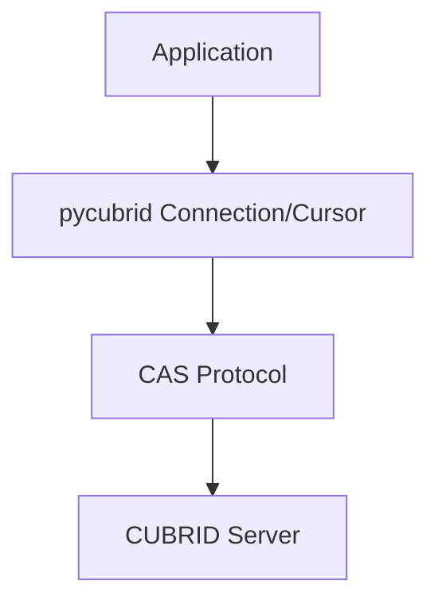

# pycubrid

**CUBRID डेटाबेस के लिए शुद्ध Python DB-API 2.0 ड्राइवर** — बिना C एक्सटेंशन, बिना कम्पाइलेशन, PEP 249 (DB-API 2.0) इंटरफ़ेस को लागू करता है।

[🇰🇷 한국어](README.ko.md) · [🇺🇸 English](../README.md) · [🇨🇳 中文](README.zh.md) · [🇮🇳 हिन्दी](README.hi.md) · [🇩🇪 Deutsch](README.de.md) · [🇷🇺 Русский](README.ru.md)

<!-- BADGES:START -->
[](https://pypi.org/project/pycubrid)
[](https://www.python.org)
[](https://github.com/cubrid-lab/pycubrid/actions/workflows/ci.yml)
[](https://github.com/cubrid-lab/pycubrid/actions/workflows/integration-full.yml)
[](https://codecov.io/gh/cubrid-lab/pycubrid)
[](https://github.com/cubrid-lab/pycubrid/blob/main/LICENSE)
[](https://github.com/cubrid-lab/pycubrid)
[](https://cubrid-lab.github.io/pycubrid/)
<!-- BADGES:END -->

---

> **स्थिति: Beta.** मुख्य सार्वजनिक API semantic versioning का पालन करता है; जब तक परियोजना सक्रिय विकास में है, minor releases में नई सुविधाएँ और बग फिक्स शामिल हो सकते हैं।

## pycubrid क्यों?

CUBRID एक उच्च-प्रदर्शन ओपन-सोर्स रिलेशनल डेटाबेस है, जिसका उपयोग कोरियाई सार्वजनिक
क्षेत्र और एंटरप्राइज़ अनुप्रयोगों में व्यापक रूप से किया जाता है। मौजूदा C एक्सटेंशन
ड्राइवर (`CUBRIDdb`) में build dependencies और platform compatibility की समस्याएँ थीं।

**pycubrid** इन समस्याओं को हल करता है:

- **शुद्ध Python कार्यान्वयन** — कोई C build dependency नहीं, केवल `pip install` से इंस्टॉल
- **PEP 249 (DB-API 2.0) लागू करता है** — मानक exception hierarchy, type objects, और cursor interface
- **770 ऑफ़लाइन टेस्ट / कुल 811** के साथ **97.29% code coverage** — अधिकांश टेस्ट डेटाबेस के बिना चलते हैं
- **सिंक और एसिंक कनेक्शन दोनों के लिए TLS/SSL** — `connect()` और `pycubrid.aio.connect()` पर वैकल्पिक `ssl=True` (verified context, TLS 1.2 minimum) या कस्टम `ssl.SSLContext`
- **नेटिव asyncio सपोर्ट** — उच्च-concurrency अनुप्रयोगों के लिए `pycubrid.aio` के जरिए async/await API
- **PEP 561 typed package** — आधुनिक IDE और static analysis support के लिए `py.typed` marker
- **CUBRID CAS protocol का सीधा implementation** — किसी अतिरिक्त middleware की आवश्यकता नहीं
- **LOB (CLOB/BLOB) सपोर्ट** — बड़े text और binary data को संभालें

## आवश्यकताएँ

- Python 3.10+
- CUBRID डेटाबेस सर्वर 10.2+

## इंस्टॉलेशन

```bash
pip install pycubrid
```

## त्वरित शुरुआत

### बुनियादी कनेक्शन

```python
import pycubrid

conn = pycubrid.connect(
    host="localhost",
    port=33000,
    database="testdb",
    user="dba",
    password="",
)

cur = conn.cursor()
cur.execute("SELECT 1 + 1")
print(cur.fetchone())  # (2,)

cur.close()
conn.close()
```

### कॉन्टेक्स्ट मैनेजर

```python
import pycubrid

with pycubrid.connect(host="localhost", port=33000, database="testdb", user="dba") as conn:
    with conn.cursor() as cur:
        cur.execute("CREATE TABLE IF NOT EXISTS cookbook_users (id INT AUTO_INCREMENT PRIMARY KEY, name VARCHAR(100))")
        cur.execute("INSERT INTO cookbook_users (name) VALUES (?)", ("Alice",))
        conn.commit()

        cur.execute("SELECT * FROM cookbook_users")
        for row in cur:
            print(row)
```

### Async

```python
import asyncio
import pycubrid.aio

async def main():
    conn = await pycubrid.aio.connect(
        host="localhost", port=33000, database="testdb", user="dba"
    )
    cur = conn.cursor()
    await cur.execute("SELECT 1 + 1")
    print(await cur.fetchone())  # (2,)
    await cur.close()
    await conn.close()

asyncio.run(main())
```

### पैरामीटर बाइंडिंग

```python
# qmark शैली (प्रश्न चिह्न)
cur.execute("SELECT * FROM users WHERE name = ? AND age > ?", ("Alice", 25))

# executemany के साथ batch insert
data = [("Alice", 30), ("Bob", 25), ("Charlie", 35)]
cur.executemany("INSERT INTO users (name, age) VALUES (?, ?)", data)
conn.commit()
```

### पैरामीटराइज़्ड क्वेरी

```python
sql = "SELECT * FROM users WHERE department = ?"

cur.execute(sql, ("Engineering",))
engineers = cur.fetchall()

cur.execute(sql, ("Marketing",))
marketers = cur.fetchall()
```

## PEP 249 अनुपालन

| विशेषता | मान |
|---|---|
| `apilevel` | `"2.0"` |
| `threadsafety` | `1` (कनेक्शन threads के बीच साझा नहीं किए जा सकते) |
| `paramstyle` | `"qmark"` (positional parameters `?`) |

- पूर्ण मानक exception hierarchy: `Warning`, `Error`, `InterfaceError`, `DatabaseError`, `OperationalError`, `IntegrityError`, `InternalError`, `ProgrammingError`, `NotSupportedError`
- मानक type objects: `STRING`, `BINARY`, `NUMBER`, `DATETIME`, `ROWID`
- मानक constructors: `Date()`, `Time()`, `Timestamp()`, `Binary()`, `DateFromTicks()`, `TimeFromTicks()`, `TimestampFromTicks()`

## विशेषताएँ

- **शुद्ध Python** — कोई C एक्सटेंशन नहीं, कोई कम्पाइलेशन नहीं, जहाँ Python चलता है वहाँ काम करता है
- **पूर्ण DB-API 2.0** — `connect()`, `Cursor`, `fetchone/many/all`, `executemany`, `callproc`
- **पैरामीटराइज़्ड क्वेरी** — server-side `PREPARE_AND_EXECUTE` के साथ `cursor.execute(sql, params)`
- **बैच ऑपरेशन** — bulk inserts के लिए `executemany()` और `executemany_batch()`
- **LOB सपोर्ट** — `create_lob()`, CLOB और BLOB कॉलम का read/write
- **स्कीमा introspection** — tables, columns, indexes, constraints के लिए `get_schema_info()`
- **Auto-commit नियंत्रण** — transaction management के लिए `connection.autocommit` property
- **Server version detection** — `connection.get_server_version()` version string लौटाता है (उदाहरण: `"11.2.0.0378"`)
- **Iterator protocol** — `for row in cursor` के साथ cursor results पर iterate करें
- **Context managers** — connections और cursors दोनों के लिए `with` statements
- **Async सपोर्ट** — asyncio event loops के लिए `pycubrid.aio.connect()` के साथ `AsyncConnection` और `AsyncCursor`

## समर्थित CUBRID संस्करण

यह परियोजना CUBRID 10.x और 11.x को लक्षित करती है और CI में निम्न संस्करणों के खिलाफ validate की जाती है:

- 10.2
- 11.0
- 11.2
- 11.4

## SQLAlchemy एकीकरण

pycubrid, [sqlalchemy-cubrid](https://github.com/cubrid-lab/sqlalchemy-cubrid) — CUBRID के लिए SQLAlchemy 2.0 dialect — के ड्राइवर के रूप में काम करता है:

```bash
pip install "sqlalchemy-cubrid[pycubrid]"
```

```python
from sqlalchemy import create_engine, text

engine = create_engine("cubrid+pycubrid://dba@localhost:33000/testdb")

with engine.connect() as conn:
    result = conn.execute(text("SELECT 1"))
    print(result.scalar())
```

जब pycubrid को sqlalchemy-cubrid के साथ उपयोग किया जाता है, तब SQLAlchemy की सुविधाएँ (ORM, Core, Alembic migrations, schema reflection) उपलब्ध होती हैं।

## प्रलेखन

| मार्गदर्शिका | विवरण |
|---|---|
| [कनेक्शन](CONNECTION.md) | कनेक्शन स्ट्रिंग, URL प्रारूप, कॉन्फ़िगरेशन |
| [टाइप मैपिंग](TYPES.md) | पूर्ण टाइप मैपिंग, CUBRID-विशिष्ट टाइप, कलेक्शन टाइप |
| [API संदर्भ](API_REFERENCE.md) | पूर्ण API प्रलेखन — मॉड्यूल, क्लास, फ़ंक्शन |
| [प्रोटोकॉल](PROTOCOL.md) | CAS wire protocol संदर्भ |
| [डेवलपमेंट](DEVELOPMENT.md) | डेव सेटअप, टेस्टिंग, Docker, कवरेज, CI/CD |
| [उदाहरण](EXAMPLES.md) | कोड के साथ व्यावहारिक उपयोग उदाहरण |
| [समस्या निवारण](TROUBLESHOOTING.md) | कनेक्शन त्रुटियाँ, क्वेरी समस्याएँ, LOB हैंडलिंग, डिबगिंग |

## संगतता

| | Python 3.10 | Python 3.11 | Python 3.12 | Python 3.13 | Python 3.14 |
|---|:---:|:---:|:---:|:---:|:---:|
| **ऑफ़लाइन टेस्ट** | ✅ | ✅ | ✅ | ✅ | ✅ |
| **CUBRID 11.4** | ✅ | -- | -- | -- | ✅ |
| **CUBRID 11.2** | ✅ | -- | -- | -- | ✅ |
| **CUBRID 11.0** | ✅ | -- | -- | -- | ✅ |
| **CUBRID 10.2** | ✅ | -- | -- | -- | ✅ |

CI हर PR/push पर ऊपर दी गई matrix चलाता है (Python 3.10 + 3.14 anchors × सभी CUBRID versions)।
पूर्ण **5 × 4** Python × CUBRID matrix nightly, tagged releases पर, और `workflow_dispatch` के जरिए on demand चलती है।

## आर्किटेक्चर



```mermaid
graph TD
    root[pycubrid/]
    init[__init__.py - Public API connect(), types, exceptions, __version__]
    connection[connection.py - Connection class connect/commit/rollback/cursor/LOB]
    cursor[cursor.py - Cursor class execute/fetch/executemany/callproc/iterator]
    types[types.py - DB-API 2.0 type objects and constructors]
    exceptions[exceptions.py - PEP 249 exception hierarchy]
    constants[constants.py - CAS function codes, data types, protocol constants]
    protocol[protocol.py - CAS wire protocol packet classes (18 packet types)]
    packet[packet.py - Low-level packet reader/writer]
    lob[lob.py - LOB support]
    typed[py.typed - PEP 561 marker]

    root --> init
    root --> connection
    root --> cursor
    root --> types
    root --> exceptions
    root --> constants
    root --> protocol
    root --> packet
    root --> lob
    root --> typed
    root --> aio
    aio[aio/ - AsyncConnection, AsyncCursor, async connect()]
```

## FAQ

### मैं Python से CUBRID से कैसे कनेक्ट करूँ?

```python
import pycubrid
conn = pycubrid.connect(host="localhost", port=33000, database="testdb", user="dba")
```

### मैं pycubrid कैसे इंस्टॉल करूँ?

`pip install pycubrid` — किसी C एक्सटेंशन या build tools की आवश्यकता नहीं।

### pycubrid कौन-सी parameter style का उपयोग करता है?

Question mark (`qmark`) शैली: `cursor.execute("SELECT * FROM users WHERE id = ?", (1,))`

### क्या pycubrid SQLAlchemy के साथ काम करता है?

हाँ। `pip install "sqlalchemy-cubrid[pycubrid]"` इंस्टॉल करें और कनेक्शन URL `cubrid+pycubrid://dba@localhost:33000/testdb` का उपयोग करें।

### कौन-से Python versions समर्थित हैं?

Python 3.10, 3.11, 3.12, 3.13, और 3.14।

### क्या pycubrid LOBs (CLOB/BLOB) को सपोर्ट करता है?

हाँ। आप strings/bytes को सीधे CLOB/BLOB columns में insert कर सकते हैं। पढ़ने पर, LOB columns ऐसा डेटा लौटाते हैं जिसे cursor के माध्यम से access किया जा सकता है।

### क्या pycubrid thread-safe है?

pycubrid का `threadsafety = 1` है, जिसका अर्थ है कि connections threads के बीच साझा नहीं किए जा सकते। हर thread के लिए अलग connection बनाएँ।

### कौन-से CUBRID versions समर्थित हैं?

CUBRID 10.2, 11.0, 11.2, और 11.4 CI में टेस्ट किए जाते हैं।

### क्या pycubrid async/await को सपोर्ट करता है?

हाँ। Native asyncio support के लिए `pycubrid.aio.connect()` का उपयोग करें। Async surface sync API के काफ़ी समान है: `await conn.ping(reconnect=...)` sync `Connection.ping()` जैसा ही native `CHECK_CAS` health check चलाता है, `create_lob()` अभी भी sync-only रहता है, और auto-commit changes property setter की जगह `await conn.set_autocommit(...)` का उपयोग करती हैं।


## संबंधित परियोजनाएँ

- [sqlalchemy-cubrid](https://github.com/cubrid-lab/sqlalchemy-cubrid) — CUBRID के लिए SQLAlchemy 2.0 dialect
- [cubrid-python-cookbook](https://github.com/cubrid-lab/cubrid-python-cookbook) — CUBRID के लिए production-ready Python उदाहरण


## रोडमैप

इस परियोजना की दिशा और अगले milestones के लिए [`ROADMAP.md`](../ROADMAP.md) देखें।

पूरे ecosystem के दृष्टिकोण के लिए [CUBRID Labs Ecosystem Roadmap](https://github.com/cubrid-lab/.github/blob/main/ROADMAP.md) और [Project Board](https://github.com/orgs/cubrid-lab/projects/2) देखें।

## योगदान

दिशानिर्देशों के लिए [CONTRIBUTING.md](../CONTRIBUTING.md) और development setup के लिए [docs/DEVELOPMENT.md](DEVELOPMENT.md) देखें।

## सुरक्षा

कमज़ोरियों की रिपोर्ट ईमेल के माध्यम से करें — विवरण के लिए [SECURITY.md](../SECURITY.md) देखें। सुरक्षा चिंताओं के लिए सार्वजनिक issues न खोलें।

## लाइसेंस

MIT — [LICENSE](../LICENSE) देखें.
