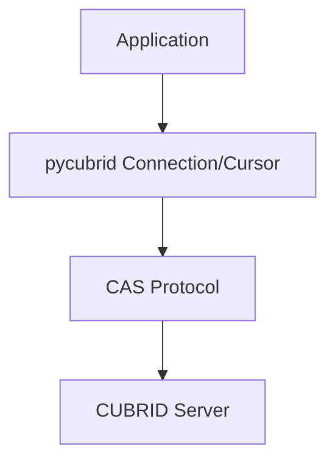

# pycubrid

**CUBRID 데이터베이스를 위한 순수 Python DB-API 2.0 드라이버** — C 확장 없이, 컴파일 없이, PEP 249(DB-API 2.0) 인터페이스를 구현합니다.

[🇰🇷 한국어](README.ko.md) · [🇺🇸 English](../README.md) · [🇨🇳 中文](README.zh.md) · [🇮🇳 हिन्दी](README.hi.md) · [🇩🇪 Deutsch](README.de.md) · [🇷🇺 Русский](README.ru.md)

<!-- BADGES:START -->
[](https://pypi.org/project/pycubrid)
[](https://www.python.org)
[](https://github.com/cubrid-lab/pycubrid/actions/workflows/ci.yml)
[](https://github.com/cubrid-lab/pycubrid/actions/workflows/integration-full.yml)
[](https://codecov.io/gh/cubrid-lab/pycubrid)
[](https://github.com/cubrid-lab/pycubrid/blob/main/LICENSE)
[](https://github.com/cubrid-lab/pycubrid)
[](https://cubrid-lab.github.io/pycubrid/)
<!-- BADGES:END -->

---

> **상태: Beta.** 핵심 공개 API는 시맨틱 버저닝을 따르며, 프로젝트가 활발히 개발되는 동안 마이너 릴리스에는 기능 추가와 버그 수정이 포함될 수 있습니다.

## 왜 pycubrid인가?

CUBRID는 고성능 오픈소스 관계형 데이터베이스로, 한국 공공기관 및 기업 환경에서
널리 사용되고 있습니다. 기존 C 확장 드라이버(`CUBRIDdb`)는 빌드 의존성과
플랫폼 호환성 문제가 있었습니다.

**pycubrid**는 이러한 문제를 해결합니다:

- **순수 Python 구현** — C 빌드 의존성 없이 `pip install`만으로 설치
- **PEP 249(DB-API 2.0) 구현** — 표준 예외 계층, 타입 객체, 커서 인터페이스 제공
- **오프라인 테스트 770개 / 전체 811개**, **코드 커버리지 97.29%** — 대부분의 테스트를 데이터베이스 없이 실행 가능
- **동기/비동기 연결용 TLS/SSL 지원** — `connect()`와 `pycubrid.aio.connect()`에서 `ssl=True`(검증된 컨텍스트, TLS 1.2 최소 버전) 또는 사용자 지정 `ssl.SSLContext` 선택 가능
- **네이티브 asyncio 지원** — 고동시성 애플리케이션을 위한 `pycubrid.aio` 기반 async/await API
- **PEP 561 타입 패키지** — `py.typed` 마커로 최신 IDE 및 정적 분석 도구 지원
- **CUBRID CAS 프로토콜 직접 구현** — 별도 미들웨어 불필요
- **LOB(CLOB/BLOB) 지원** — 대용량 텍스트 및 바이너리 데이터 처리

## 요구 사항

- Python 3.10+
- CUBRID 데이터베이스 서버 10.2+

## 설치

```bash
pip install pycubrid
```

## 빠른 시작

### 기본 연결

```python
import pycubrid

conn = pycubrid.connect(
    host="localhost",
    port=33000,
    database="testdb",
    user="dba",
    password="",
)

cur = conn.cursor()
cur.execute("SELECT 1 + 1")
print(cur.fetchone())  # (2,)

cur.close()
conn.close()
```

### 컨텍스트 매니저

```python
import pycubrid

with pycubrid.connect(host="localhost", port=33000, database="testdb", user="dba") as conn:
    with conn.cursor() as cur:
        cur.execute("CREATE TABLE IF NOT EXISTS cookbook_users (id INT AUTO_INCREMENT PRIMARY KEY, name VARCHAR(100))")
        cur.execute("INSERT INTO cookbook_users (name) VALUES (?)", ("Alice",))
        conn.commit()

        cur.execute("SELECT * FROM cookbook_users")
        for row in cur:
            print(row)
```

### Async

```python
import asyncio
import pycubrid.aio

async def main():
    conn = await pycubrid.aio.connect(
        host="localhost", port=33000, database="testdb", user="dba"
    )
    cur = conn.cursor()
    await cur.execute("SELECT 1 + 1")
    print(await cur.fetchone())  # (2,)
    await cur.close()
    await conn.close()

asyncio.run(main())
```

### 매개변수 바인딩

```python
# qmark 스타일 (물음표)
cur.execute("SELECT * FROM users WHERE name = ? AND age > ?", ("Alice", 25))

# executemany를 사용한 배치 삽입
data = [("Alice", 30), ("Bob", 25), ("Charlie", 35)]
cur.executemany("INSERT INTO users (name, age) VALUES (?, ?)", data)
conn.commit()
```

### 매개변수화된 쿼리

```python
sql = "SELECT * FROM users WHERE department = ?"

cur.execute(sql, ("Engineering",))
engineers = cur.fetchall()

cur.execute(sql, ("Marketing",))
marketers = cur.fetchall()
```

## PEP 249 준수 사항

| 속성 | 값 |
|---|---|
| `apilevel` | `"2.0"` |
| `threadsafety` | `1` (연결은 스레드 간 공유 불가) |
| `paramstyle` | `"qmark"` (위치 매개변수 `?`) |

- 완전한 표준 예외 계층: `Warning`, `Error`, `InterfaceError`, `DatabaseError`, `OperationalError`, `IntegrityError`, `InternalError`, `ProgrammingError`, `NotSupportedError`
- 표준 타입 객체: `STRING`, `BINARY`, `NUMBER`, `DATETIME`, `ROWID`
- 표준 생성자: `Date()`, `Time()`, `Timestamp()`, `Binary()`, `DateFromTicks()`, `TimeFromTicks()`, `TimestampFromTicks()`

## 주요 기능

- **순수 Python** — C 확장과 컴파일 없이, Python이 실행되는 곳이라면 어디서나 동작
- **완전한 DB-API 2.0** — `connect()`, `Cursor`, `fetchone/many/all`, `executemany`, `callproc`
- **매개변수화된 쿼리** — 서버 측 `PREPARE_AND_EXECUTE`를 사용하는 `cursor.execute(sql, params)`
- **배치 작업** — 대량 삽입을 위한 `executemany()` 및 `executemany_batch()`
- **LOB 지원** — `create_lob()`, CLOB/BLOB 컬럼 읽기/쓰기
- **스키마 인트로스펙션** — 테이블, 컬럼, 인덱스, 제약 조건 확인용 `get_schema_info()`
- **자동 커밋 제어** — 트랜잭션 관리를 위한 `connection.autocommit` 속성
- **서버 버전 감지** — `connection.get_server_version()`이 버전 문자열(예: `"11.2.0.0378"`) 반환
- **이터레이터 프로토콜** — `for row in cursor`로 커서 결과 반복 가능
- **컨텍스트 매니저** — 연결과 커서 모두 `with` 문 지원
- **Async 지원** — asyncio 이벤트 루프를 위한 `AsyncConnection`, `AsyncCursor`, `pycubrid.aio.connect()`

## 지원 CUBRID 버전

이 프로젝트는 CUBRID 10.x 및 11.x를 대상으로 하며, CI에서 다음 버전을 검증합니다:

- 10.2
- 11.0
- 11.2
- 11.4

## SQLAlchemy 연동

pycubrid는 [sqlalchemy-cubrid](https://github.com/cubrid-lab/sqlalchemy-cubrid) — CUBRID용 SQLAlchemy 2.0 방언의 드라이버로 동작합니다:

```bash
pip install "sqlalchemy-cubrid[pycubrid]"
```

```python
from sqlalchemy import create_engine, text

engine = create_engine("cubrid+pycubrid://dba@localhost:33000/testdb")

with engine.connect() as conn:
    result = conn.execute(text("SELECT 1"))
    print(result.scalar())
```

sqlalchemy-cubrid와 함께 사용할 때 ORM, Core, Alembic 마이그레이션, 스키마 리플렉션 등 SQLAlchemy 기능을 pycubrid 드라이버를 통해 사용할 수 있습니다.

## 문서

| 가이드 | 설명 |
|---|---|
| [연결](CONNECTION.md) | 연결 문자열, URL 형식, 구성 옵션 |
| [타입 매핑](TYPES.md) | 전체 타입 매핑, CUBRID 전용 타입, 컬렉션 타입 |
| [API 레퍼런스](API_REFERENCE.md) | 전체 API 문서 — 모듈, 클래스, 함수 |
| [프로토콜](PROTOCOL.md) | CAS 와이어 프로토콜 레퍼런스 |
| [개발 가이드](DEVELOPMENT.md) | 개발 환경 설정, 테스트, Docker, 커버리지, CI/CD |
| [예제](EXAMPLES.md) | 실용적인 사용 예제와 코드 |
| [문제 해결](TROUBLESHOOTING.md) | 연결 오류, 쿼리 문제, LOB 처리, 디버깅 |

## 호환성

| | Python 3.10 | Python 3.11 | Python 3.12 | Python 3.13 | Python 3.14 |
|---|:---:|:---:|:---:|:---:|:---:|
| **오프라인 테스트** | ✅ | ✅ | ✅ | ✅ | ✅ |
| **CUBRID 11.4** | ✅ | -- | -- | -- | ✅ |
| **CUBRID 11.2** | ✅ | -- | -- | -- | ✅ |
| **CUBRID 11.0** | ✅ | -- | -- | -- | ✅ |
| **CUBRID 10.2** | ✅ | -- | -- | -- | ✅ |

CI는 모든 PR/푸시에서 위 매트릭스(Python 3.10 + 3.14 앵커 × 모든 CUBRID 버전)를 실행합니다.
전체 **5 × 4** Python × CUBRID 매트릭스는 매일 밤, 태그 릴리스 시, 그리고 `workflow_dispatch`로 수동 실행할 수 있습니다.

## 아키텍처



```mermaid
graph TD
    root[pycubrid/]
    init[__init__.py - Public API connect(), types, exceptions, __version__]
    connection[connection.py - Connection class connect/commit/rollback/cursor/LOB]
    cursor[cursor.py - Cursor class execute/fetch/executemany/callproc/iterator]
    types[types.py - DB-API 2.0 type objects and constructors]
    exceptions[exceptions.py - PEP 249 exception hierarchy]
    constants[constants.py - CAS function codes, data types, protocol constants]
    protocol[protocol.py - CAS wire protocol packet classes (18 packet types)]
    packet[packet.py - Low-level packet reader/writer]
    lob[lob.py - LOB support]
    typed[py.typed - PEP 561 marker]

    root --> init
    root --> connection
    root --> cursor
    root --> types
    root --> exceptions
    root --> constants
    root --> protocol
    root --> packet
    root --> lob
    root --> typed
    root --> aio
    aio[aio/ - AsyncConnection, AsyncCursor, async connect()]
```

## FAQ

### Python에서 CUBRID에 어떻게 연결하나요?

```python
import pycubrid
conn = pycubrid.connect(host="localhost", port=33000, database="testdb", user="dba")
```

### pycubrid는 어떻게 설치하나요?

`pip install pycubrid` — C 확장이나 빌드 도구가 필요 없습니다.

### pycubrid는 어떤 매개변수 스타일을 사용하나요?

물음표(`qmark`) 스타일입니다: `cursor.execute("SELECT * FROM users WHERE id = ?", (1,))`

### pycubrid는 SQLAlchemy와 함께 사용할 수 있나요?

예. `pip install "sqlalchemy-cubrid[pycubrid]"`로 설치한 뒤 연결 URL `cubrid+pycubrid://dba@localhost:33000/testdb`를 사용하세요.

### 어떤 Python 버전을 지원하나요?

Python 3.10, 3.11, 3.12, 3.13, 3.14를 지원합니다.

### pycubrid는 LOB(CLOB/BLOB)를 지원하나요?

예. CLOB/BLOB 컬럼에 문자열/바이트를 직접 삽입할 수 있습니다. 읽을 때는 커서에서 접근 가능한 형태로 LOB 컬럼 데이터를 반환합니다.

### pycubrid는 스레드 세이프한가요?

pycubrid의 `threadsafety = 1`은 연결을 스레드 간에 공유할 수 없음을 의미합니다. 스레드마다 별도의 연결을 생성해야 합니다.

### 어떤 CUBRID 버전을 지원하나요?

CUBRID 10.2, 11.0, 11.2, 11.4를 CI에서 테스트합니다.

### pycubrid는 async/await를 지원하나요?

예. 네이티브 asyncio 지원을 위해 `pycubrid.aio.connect()`를 사용하세요. async API의 표면은 sync API와 비슷합니다. `await conn.ping(reconnect=...)`로 sync `Connection.ping()`과 동일한 네이티브 `CHECK_CAS` 헬스 체크를 수행할 수 있고, `create_lob()`만 여전히 sync 전용이며, 자동 커밋 변경은 속성 setter 대신 `await conn.set_autocommit(...)`를 사용합니다.


## 관련 프로젝트

- [sqlalchemy-cubrid](https://github.com/cubrid-lab/sqlalchemy-cubrid) — CUBRID용 SQLAlchemy 2.0 방언
- [cubrid-python-cookbook](https://github.com/cubrid-lab/cubrid-python-cookbook) — CUBRID를 위한 프로덕션용 Python 예제


## 로드맵

이 프로젝트의 방향과 다음 마일스톤은 [`ROADMAP.md`](../ROADMAP.md)를 참고하세요.

생태계 전체 관점은 [CUBRID Labs Ecosystem Roadmap](https://github.com/cubrid-lab/.github/blob/main/ROADMAP.md)과 [프로젝트 보드](https://github.com/orgs/cubrid-lab/projects/2)를 참고하세요.

## 기여하기

가이드라인은 [CONTRIBUTING.md](../CONTRIBUTING.md), 개발 환경 설정은 [docs/DEVELOPMENT.md](DEVELOPMENT.md)를 참고하세요.

## 보안

취약점은 이메일로 제보해 주세요 — 자세한 내용은 [SECURITY.md](../SECURITY.md)를 참고하세요. 보안 관련 사항은 공개 이슈로 등록하지 마세요.

## 라이선스

MIT — [LICENSE](../LICENSE) 참조.
