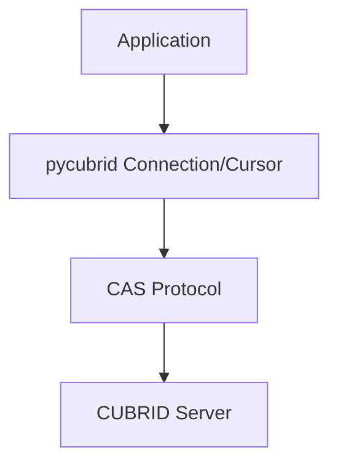

# pycubrid

**适用于 CUBRID 数据库的纯 Python DB-API 2.0 驱动** — 无需 C 扩展、无需编译，实现了 PEP 249（DB-API 2.0）接口。

[🇰🇷 한국어](README.ko.md) · [🇺🇸 English](../README.md) · [🇨🇳 中文](README.zh.md) · [🇮🇳 हिन्दी](README.hi.md) · [🇩🇪 Deutsch](README.de.md) · [🇷🇺 Русский](README.ru.md)

<!-- BADGES:START -->
[](https://pypi.org/project/pycubrid)
[](https://www.python.org)
[](https://github.com/cubrid-lab/pycubrid/actions/workflows/ci.yml)
[](https://github.com/cubrid-lab/pycubrid/actions/workflows/integration-full.yml)
[](https://codecov.io/gh/cubrid-lab/pycubrid)
[](https://github.com/cubrid-lab/pycubrid/blob/main/LICENSE)
[](https://github.com/cubrid-lab/pycubrid)
[](https://cubrid-lab.github.io/pycubrid/)
<!-- BADGES:END -->

---

> **状态：Beta。** 核心公共 API 遵循语义化版本控制；在项目仍处于积极开发阶段时，次版本发布可能会增加新功能和错误修复。

## 为什么选择 pycubrid？

CUBRID 是一款高性能开源关系型数据库，在韩国公共部门和企业应用中被广泛采用。
现有的 C 扩展驱动（`CUBRIDdb`）存在构建依赖和平台兼容性问题。

**pycubrid** 解决了这些问题：

- **纯 Python 实现** — 无需 C 构建依赖，只需 `pip install`
- **实现 PEP 249（DB-API 2.0）** — 标准异常层级、类型对象和游标接口
- **770 个离线测试 / 811 个总测试**，**97.29% 代码覆盖率** — 大多数测试无需数据库即可运行
- **同步/异步连接均支持 TLS/SSL** — 在 `connect()` 和 `pycubrid.aio.connect()` 中可选 `ssl=True`（已验证上下文，最低 TLS 1.2）或自定义 `ssl.SSLContext`
- **原生 asyncio 支持** — 通过 `pycubrid.aio` 提供 async/await API，适用于高并发应用
- **PEP 561 类型化包** — `py.typed` 标记支持现代 IDE 和静态分析工具
- **直接实现 CUBRID CAS 协议** — 无需额外中间件
- **支持 LOB（CLOB/BLOB）** — 可处理大文本和二进制数据

## 环境要求

- Python 3.10+
- CUBRID 数据库服务器 10.2+

## 安装

```bash
pip install pycubrid
```

## 快速开始

### 基本连接

```python
import pycubrid

conn = pycubrid.connect(
    host="localhost",
    port=33000,
    database="testdb",
    user="dba",
    password="",
)

cur = conn.cursor()
cur.execute("SELECT 1 + 1")
print(cur.fetchone())  # (2,)

cur.close()
conn.close()
```

### 上下文管理器

```python
import pycubrid

with pycubrid.connect(host="localhost", port=33000, database="testdb", user="dba") as conn:
    with conn.cursor() as cur:
        cur.execute("CREATE TABLE IF NOT EXISTS cookbook_users (id INT AUTO_INCREMENT PRIMARY KEY, name VARCHAR(100))")
        cur.execute("INSERT INTO cookbook_users (name) VALUES (?)", ("Alice",))
        conn.commit()

        cur.execute("SELECT * FROM cookbook_users")
        for row in cur:
            print(row)
```

### Async

```python
import asyncio
import pycubrid.aio

async def main():
    conn = await pycubrid.aio.connect(
        host="localhost", port=33000, database="testdb", user="dba"
    )
    cur = conn.cursor()
    await cur.execute("SELECT 1 + 1")
    print(await cur.fetchone())  # (2,)
    await cur.close()
    await conn.close()

asyncio.run(main())
```

### 参数绑定

```python
# qmark 风格（问号占位符）
cur.execute("SELECT * FROM users WHERE name = ? AND age > ?", ("Alice", 25))

# 使用 executemany 批量插入
data = [("Alice", 30), ("Bob", 25), ("Charlie", 35)]
cur.executemany("INSERT INTO users (name, age) VALUES (?, ?)", data)
conn.commit()
```

### 参数化查询

```python
sql = "SELECT * FROM users WHERE department = ?"

cur.execute(sql, ("Engineering",))
engineers = cur.fetchall()

cur.execute(sql, ("Marketing",))
marketers = cur.fetchall()
```

## PEP 249 兼容性

| 属性 | 值 |
|---|---|
| `apilevel` | `"2.0"` |
| `threadsafety` | `1`（连接不能在线程之间共享） |
| `paramstyle` | `"qmark"`（位置参数 `?`） |

- 完整标准异常层级：`Warning`、`Error`、`InterfaceError`、`DatabaseError`、`OperationalError`、`IntegrityError`、`InternalError`、`ProgrammingError`、`NotSupportedError`
- 标准类型对象：`STRING`、`BINARY`、`NUMBER`、`DATETIME`、`ROWID`
- 标准构造函数：`Date()`、`Time()`、`Timestamp()`、`Binary()`、`DateFromTicks()`、`TimeFromTicks()`、`TimestampFromTicks()`

## 功能特性

- **纯 Python** — 无需 C 扩展、无需编译，在 Python 能运行的地方都能工作
- **完整 DB-API 2.0** — `connect()`、`Cursor`、`fetchone/many/all`、`executemany`、`callproc`
- **参数化查询** — `cursor.execute(sql, params)`，使用服务端 `PREPARE_AND_EXECUTE`
- **批量操作** — `executemany()` 和 `executemany_batch()` 用于批量插入
- **LOB 支持** — `create_lob()`，读写 CLOB 和 BLOB 列
- **模式自省** — `get_schema_info()` 用于表、列、索引和约束
- **自动提交控制** — 使用 `connection.autocommit` 属性管理事务
- **服务器版本检测** — `connection.get_server_version()` 返回版本字符串（例如 `"11.2.0.0378"`）
- **迭代器协议** — 可通过 `for row in cursor` 遍历游标结果
- **上下文管理器** — 连接和游标都支持 `with` 语句
- **Async 支持** — `pycubrid.aio.connect()` 搭配 `AsyncConnection` 和 `AsyncCursor`，适用于 asyncio 事件循环

## 支持的 CUBRID 版本

该项目面向 CUBRID 10.x 和 11.x，并在 CI 中针对以下版本进行验证：

- 10.2
- 11.0
- 11.2
- 11.4

## SQLAlchemy 集成

pycubrid 可作为 [sqlalchemy-cubrid](https://github.com/cubrid-lab/sqlalchemy-cubrid) 的驱动使用——它是面向 CUBRID 的 SQLAlchemy 2.0 方言：

```bash
pip install "sqlalchemy-cubrid[pycubrid]"
```

```python
from sqlalchemy import create_engine, text

engine = create_engine("cubrid+pycubrid://dba@localhost:33000/testdb")

with engine.connect() as conn:
    result = conn.execute(text("SELECT 1"))
    print(result.scalar())
```

与 sqlalchemy-cubrid 一起使用时，可通过 pycubrid 驱动访问 SQLAlchemy 的 ORM、Core、Alembic 迁移和模式反射等功能。

## 文档

| 指南 | 描述 |
|---|---|
| [连接](CONNECTION.md) | 连接字符串、URL 格式、配置 |
| [类型映射](TYPES.md) | 完整类型映射、CUBRID 特有类型、集合类型 |
| [API 参考](API_REFERENCE.md) | 完整 API 文档 — 模块、类、函数 |
| [协议](PROTOCOL.md) | CAS 线路协议参考 |
| [开发指南](DEVELOPMENT.md) | 开发环境设置、测试、Docker、覆盖率、CI/CD |
| [示例](EXAMPLES.md) | 实用使用示例与代码 |
| [故障排除](TROUBLESHOOTING.md) | 连接错误、查询问题、LOB 处理、调试 |

## 兼容性

| | Python 3.10 | Python 3.11 | Python 3.12 | Python 3.13 | Python 3.14 |
|---|:---:|:---:|:---:|:---:|:---:|
| **离线测试** | ✅ | ✅ | ✅ | ✅ | ✅ |
| **CUBRID 11.4** | ✅ | -- | -- | -- | ✅ |
| **CUBRID 11.2** | ✅ | -- | -- | -- | ✅ |
| **CUBRID 11.0** | ✅ | -- | -- | -- | ✅ |
| **CUBRID 10.2** | ✅ | -- | -- | -- | ✅ |

CI 会在每次 PR/推送时运行上述矩阵（以 Python 3.10 和 3.14 为锚点 × 全部 CUBRID 版本）。
完整的 **5 × 4** Python × CUBRID 矩阵会在夜间、发布标签时以及通过 `workflow_dispatch` 按需运行。

## 架构



```mermaid
graph TD
    root[pycubrid/]
    init[__init__.py - Public API connect(), types, exceptions, __version__]
    connection[connection.py - Connection class connect/commit/rollback/cursor/LOB]
    cursor[cursor.py - Cursor class execute/fetch/executemany/callproc/iterator]
    types[types.py - DB-API 2.0 type objects and constructors]
    exceptions[exceptions.py - PEP 249 exception hierarchy]
    constants[constants.py - CAS function codes, data types, protocol constants]
    protocol[protocol.py - CAS wire protocol packet classes (18 packet types)]
    packet[packet.py - Low-level packet reader/writer]
    lob[lob.py - LOB support]
    typed[py.typed - PEP 561 marker]

    root --> init
    root --> connection
    root --> cursor
    root --> types
    root --> exceptions
    root --> constants
    root --> protocol
    root --> packet
    root --> lob
    root --> typed
    root --> aio
    aio[aio/ - AsyncConnection, AsyncCursor, async connect()]
```

## FAQ

### 如何使用 Python 连接到 CUBRID？

```python
import pycubrid
conn = pycubrid.connect(host="localhost", port=33000, database="testdb", user="dba")
```

### 如何安装 pycubrid？

`pip install pycubrid` — 无需 C 扩展或构建工具。

### pycubrid 使用什么参数风格？

问号风格（`qmark`）：`cursor.execute("SELECT * FROM users WHERE id = ?", (1,))`

### pycubrid 可以与 SQLAlchemy 一起使用吗？

可以。安装 `pip install "sqlalchemy-cubrid[pycubrid]"`，并使用连接 URL `cubrid+pycubrid://dba@localhost:33000/testdb`。

### 支持哪些 Python 版本？

支持 Python 3.10、3.11、3.12、3.13 和 3.14。

### pycubrid 支持 LOB（CLOB/BLOB）吗？

支持。可以直接将字符串/字节插入 CLOB/BLOB 列。读取时，LOB 列会返回可通过游标访问的数据。

### pycubrid 是线程安全的吗？

pycubrid 的 `threadsafety = 1`，表示连接不能在线程之间共享。请为每个线程创建单独的连接。

### 支持哪些 CUBRID 版本？

CUBRID 10.2、11.0、11.2 和 11.4 已在 CI 中测试。

### pycubrid 支持 async/await 吗？

支持。使用 `pycubrid.aio.connect()` 获得原生 asyncio 支持。async 接口与 sync API 相似：`await conn.ping(reconnect=...)` 可执行与 sync `Connection.ping()` 相同的原生 `CHECK_CAS` 健康检查，`create_lob()` 仍然仅限同步接口，自动提交变更也使用 `await conn.set_autocommit(...)`，而不是属性 setter。


## 相关项目

- [sqlalchemy-cubrid](https://github.com/cubrid-lab/sqlalchemy-cubrid) — 面向 CUBRID 的 SQLAlchemy 2.0 方言
- [cubrid-python-cookbook](https://github.com/cubrid-lab/cubrid-python-cookbook) — 面向 CUBRID 的生产级 Python 示例


## 路线图

项目方向和后续里程碑请参见 [`ROADMAP.md`](../ROADMAP.md)。

生态系统全貌请参见 [CUBRID Labs Ecosystem Roadmap](https://github.com/cubrid-lab/.github/blob/main/ROADMAP.md) 和 [Project Board](https://github.com/orgs/cubrid-lab/projects/2)。

## 贡献

贡献指南请参阅 [CONTRIBUTING.md](../CONTRIBUTING.md)，开发环境设置请参阅 [docs/DEVELOPMENT.md](DEVELOPMENT.md)。

## 安全

请通过电子邮件报告漏洞——详见 [SECURITY.md](../SECURITY.md)。请勿就安全问题创建公开 issue。

## 许可证

MIT — 参见 [LICENSE](../LICENSE)。
